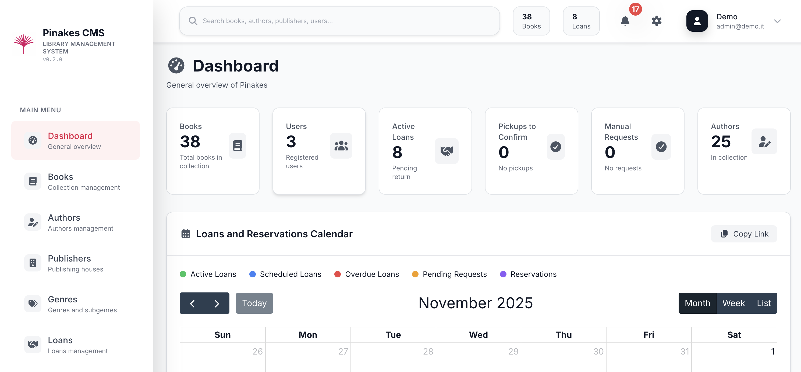
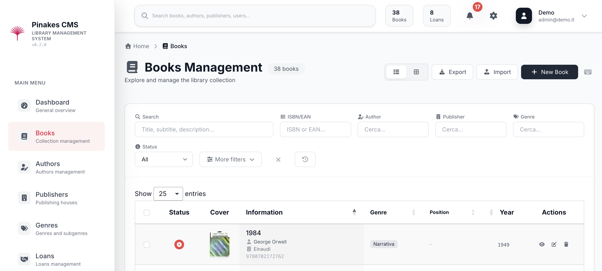
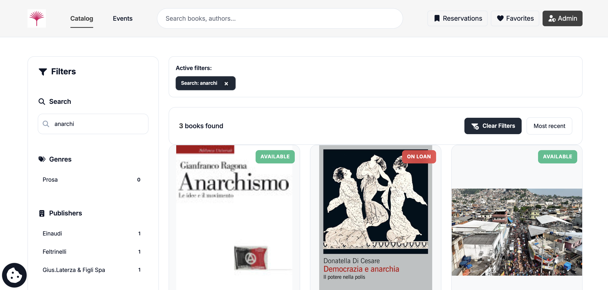

<p align="center">
  
</p>

# Pinakes 📚

> **Open-Source Integrated Library System**
> License: GPL-3  |  Languages: Italian, English, German

Pinakes is a self-hosted, full-featured ILS for schools, municipalities, and private collections. It focuses on automation, extensibility, and a usable public catalog without requiring a web team.

[](version.json)
[](installer)
[](LICENSE)

[](https://www.php.net/)

[](https://www.mysql.com/)
[](https://developer.mozilla.org/docs/Web/JavaScript)


[](https://fabiodalez-dev.github.io/Pinakes/)

---

## What's New in v0.4.9.2

### 🏷️ Genre Management, Book Filters & Bug Fixes

**Genre Management:**
- **Genre edit** — Existing genres can now be renamed and reorganized from the admin panel
- **Genre merge** — Combine two genres into one, moving all books and subgenres to the target with automatic name-conflict resolution
- **Genre rearrange** — Move a genre to a different parent (or make it top-level) via a dropdown in the edit form
- **Genre autocomplete** — New search-as-you-type for genre selection

**Book List Filters:**
- **Collana (series) filter** — Autocomplete filter in admin book list with clearable active-filters banner

**Bug Fixes:**
- **Installation crash on fresh setup** — Fixed fatal error caused by missing autoloader dependency after first install
- **Update to v0.4.9 failing** — Fixed release packaging that prevented automatic updates from working correctly
- **PDF/ePub upload error** — Fixed MIME type validation in Digital Library plugin that rejected valid PDF and ePub files
- **Author search not finding existing authors** — Fixed author autocomplete matching in the book form
- **Description field not visible** — Fixed TinyMCE editor not rendering in the book description field
- **GitHub "Download ZIP" missing pages** — Fixed archive packaging that excluded frontend view files

**German Language Support:**
- **Native German locale** — Full German translation (4,009 strings) available in the installer
- **German URL routes** — `/katalog`, `/anmelden`, `/buch`, `/autor`, `/wunschliste`, etc.
- **Dynamic language registration** — New languages added via Admin → Languages are automatically available without code changes

**Updater Improvements:**
- **GitHub API token** — Optional personal access token (Admin → Updates) to raise GitHub API rate limits from 60 to 5,000 req/hr
- **Standalone upgrade script** — `scripts/manual-upgrade.php` for users stuck on old versions

---

## Previous Releases

<details>
<summary><strong>v0.4.9</strong> - Subfolder Support, Security Hardening & Code Quality</summary>

### 🔒 Subfolder Support, Security Hardening & Code Quality

**Full Subfolder Installation Support:**
- **Install in any subdirectory** — Pinakes now runs correctly under paths like `/library/` or `/biblioteca/`, not just domain root
- **Dynamic base path detection** — `url()`, `absoluteUrl()`, and `route_path()` helpers automatically resolve the correct base path
- **Notification emails** — All email URLs use `absoluteUrl()` to generate correct full links regardless of installation path
- **JavaScript `window.BASE_PATH`** — Frontend code properly prefixes raw paths for AJAX, notifications, and API calls
- **Sitemap and SEO** — Canonical URLs, Schema.org metadata, and sitemap generation all respect base path

**Configurable Homepage Sort Order** (#59):
- **Latest Books section** — Admins can now choose sort order (newest first, alphabetical, random) from Settings

**Comprehensive Security Hardening** (177 files, 18 code review rounds):
- **XSS prevention** — Replaced all `addslashes()` with `json_encode()` + `htmlspecialchars()` across 29 view files
- **Safe JS translations** — ~176 raw PHP translations in JavaScript replaced with `json_encode(, JSON_HEX_TAG)` across 14 views
- **HTML attribute escaping** — Hardened `escapeHtml()` quote escaping + `JSON_HEX_TAG` across 12 view files
- **Route translation** — Replaced all hardcoded URL paths with `RouteTranslator::route()` / `route_path()` for locale-aware routing
- **Plugin audit** — `Exception` → `Throwable`, `error_log()` → `SecureLogger`, `JSON_HEX_TAG` on all JSON output in plugins

**Bug Fixes:**
- **Book availability** — Corrected availability calculation and reservation status display (#53, #56, #58)
- **Duplicate API route** — Removed duplicate `/api/libro/{id}/availability` route causing 500 errors
- **Integrity report** — Fixed missing issue types, response format mismatch, and `Exception` → `Throwable`
- **Collocazione** — Fixed shelf/location bugs + cURL, reservation, and author controller issues
- **Admin URLs** — Added `/admin` prefix to user DataTables action URLs, BASE_PATH to review fetch URLs
- **Email paths** — Fixed double base path in email book URLs, migrated to `absoluteUrl()`
- **Subfolder maintenance** — Resolved 503 error on maintenance mode + nested form in admin settings
- **Release packaging** — Added ZIP verification step to prevent missing TinyMCE files (#44)

**Code Quality:**
- **31 CodeRabbit review rounds** — Addressed findings across 400+ file touches
- **Proactive security hardening** — 9 pattern categories across 49 files
- **56 code quality issues** resolved in 3 core files
- **Soft-delete gaps** — Additional `deleted_at IS NULL` filters on missed queries
- **Error handling** — Consistent `\Throwable` usage across all catch blocks (strict_types compatibility)

</details>

<details>
<summary><strong>v0.4.8.2</strong> - Illustrator Field, Multi-Language & BCE Dates</summary>

### 🎨 Illustrator Field, Multi-Language & BCE Dates

**New Illustrator Field:**
- **`illustratore` column** on `libri` table — dedicated field for book illustrators
- **`illustratore` role** added to `libri_autori` enum — illustrators can be linked as authors with proper role
- **CSV import support** — Illustrator column recognized and mapped during bulk imports
- **LibraryThing import** — Illustrator field extracted from LT data
- **Book form & detail page** — Illustrator displayed alongside translator in both edit form and book card

**Multi-Language Improvements:**
- **Language column expanded** from varchar(50) to varchar(255) — supports long multi-language entries (e.g., "Italiano, English, Français")
- **Native language names** — 25+ language names normalized from Italian to native form (e.g., "inglese" → "English", "giapponese" → "日本語")
- **Multi-language display** — Book detail page shows language chips with proper formatting

**BCE Year Support:**
- **`anno_pubblicazione` now SIGNED** — range expanded from 0–65535 to -32768–32767, supporting ancient texts (e.g., The Odyssey, -800)
- **Form validation** — Book form accepts `min="-9999"` for historical works

**Bug Fixes:**
- **CSV import duplicate inventory numbers** — New `inventoryNumberExists()` check with automatic suffix prevents unique constraint violations on re-import
- **Publisher API & detail page** — Fixed phantom `e.citta` column reference
- **Loan PDF generator** — Fixed rendering issues in loan receipt generation
- **Z39 Server plugin** — SRU client fixes, bumped to v1.2.1

</details>

<details>
<summary><strong>v0.4.8.1</strong> - Import Logging & Auto-Update</summary>

### 📊 Import Logging & Auto-Update System

**Import History & Error Tracking:**
- **Import logs database** — New `import_logs` table tracks every CSV/LibraryThing import with stats, errors, and timing
- **Import history UI** — Admin panel to view past imports, filter by type/status, and download error reports as CSV
- **Import statistics** — Per-import success/failure/skipped counters with duration tracking and detailed error breakdown
- **Structured error handling** — Both import controllers now use typed error arrays (`scraping`/`validation`) instead of fragile string parsing
- **Type-safe session handling** — `$_SESSION['user_id']` properly cast to `int` to prevent `TypeError` with `strict_types`

**Auto-Update System:**
- **GitHub release integration** — Check for updates, download, and install directly from admin panel
- **Manual update upload** — Upload `.zip` packages for air-gapped environments
- **Zip Slip protection** — Path traversal validation on all archive extraction
- **Backup system** — Automatic backup before update with rollback capability
- **Database migrations** — Automatic execution of versioned SQL migrations during updates

**Security Fixes:**
- **CSRF protection** — Added `CsrfMiddleware` to manual update upload/install routes
- **No filesystem path leaks** — Update temp paths stored in session, not exposed to client
- **Cryptographic temp directories** — `random_bytes()` instead of predictable `uniqid()`
- **Orphan cleanup** — `deleteOldLogs()` now removes stale `'processing'` records older than 1 day

**Bug Fixes:**
- **Batch cover download** — Fixed HTTP 502 errors during bulk cover fetching with proper error handling and retry
- **Dewey classification display** — Hierarchy breadcrumb now renders correctly at all classification levels
- **Soft-delete consistency** — All queries on `libri` table now properly filter deleted records (`deleted_at IS NULL`)
- **Dashboard counters** — Statistics aligned with soft-delete, excluded deleted books from all counts
- **Loan status badges** — Fixed badge rendering for all loan states in history views

**Code Quality:**
- **PHPStan level 4 compliant** — All new code passes static analysis
- **Consistent error structure** — CSV and LibraryThing controllers aligned on `['line', 'title', 'message', 'type']` format
- **ISBN length validation** — `normalizeIsbn()` now rejects values that aren't 10 or 13 characters
- **Negative price rejection** — `validatePrice()` throws on negative values

</details>

<details>
<summary><strong>v0.4.8</strong> - Security & Data Integrity</summary>

### 🔒 Security & Data Integrity Release

**LibraryThing Import/Export Plugin** — Complete CSV/TSV import with flexible column mapping for LibraryThing data (29 custom fields)

**Critical Security Fixes:**
- **Image upload protection** — Pre-decode validation prevents OOM/DoS attacks (20MP pixel limit)
- **XSS prevention** — DOMPurify sanitization for TinyMCE content

**Critical Bug Fixes:**
- **Data loss fix** — Three LibraryThing fields (entry_date, dewey_wording, barcode) now properly saved
- **CSV import fixes** — Author data loss, statement leaks, chunk validation, JavaScript control flow
- **Rating validation** — Invalid ratings set to NULL instead of clamping

**Features:**
- Flexible column mapping with automatic detection for Primary Author, Secondary Author, etc.
- Star rating widget integration
- Chunked CSV processing with session state
- Comprehensive error handling and logging

**Automated Release System:**
- New `scripts/create-release.sh` prevents production errors
- Automatic vendor/ cleanup (removes dev dependencies)
- Built-in testing and verification

</details>

<details>
<summary><strong>v0.4.7.2</strong> - Minor Bug Fixes</summary>

### Minor Bug Fixes

- **Cron scripts standalone execution** — Cron jobs now load `.env` directly, working independently from web server context
- **Version display fix** — Footer now correctly shows version from `version.json`
- **Documentation improvements** — Cleanup and linting fixes across documentation files

</details>

<details>
<summary><strong>v0.4.7.1</strong> - Code Quality & Plugin Compatibility</summary>

### Code Quality & Plugin Compatibility

- **ESLint integration** — Frontend build now includes ESLint with strict rules
- **Plugin compatibility** — All pre-installed plugins updated to `max_app_version: 1.0.0`
- **Loan workflow stability** — Additional fixes to copy state transitions during approval/rejection

</details>

---

## ⚡ Quick Start

1. **Clone or download** this repository and upload all files to the root directory of your server.
2. **Visit your site's root URL** in the browser — the guided installer starts automatically.
3. **Provide database credentials** (database must be empty).
4. **Select language** (Italian, English, or German).
5. **Configure** organization name, logo, and email notifications.
6. **Create admin account** and start cataloging.

**Email configuration**: Supports both PHP `mail()` and SMTP. Required for notifications to work (loan confirmations, due-date reminders, registration approvals, reservation alerts). Can be configured during installation or later from the admin panel.

**Post-install** (optional but recommended):
- Remove/lock the `installer/` directory (button provided on final step)
- Configure SMTP, registration policy, and CMS blocks from **Admin → Settings**
- Schedule cron jobs for automated tasks:
  ```bash
  # Notifications every hour (8 AM - 8 PM)
  0 8-20 * * * /usr/bin/php /path/to/cron/automatic-notifications.php >> /var/log/biblioteca-cron.log 2>&1

  # Full maintenance at 6 AM (handles reservation/pickup expirations)
  0 6 * * * /usr/bin/php /path/to/cron/full-maintenance.php >> /var/log/biblioteca-maintenance.log 2>&1
  ```

All frontend assets are precompiled. Works on shared hosting. No Composer or build tools required on production. All configuration values can be changed later from the admin panel.

---

## Story Behind the Name

**Pinakes** comes from the ancient Greek word *πίνακες* ("tables" or "catalogues"). Callimachus of Cyrene compiled the *Pinakes* around 245 BC for the Library of Alexandria: 120 scrolls that indexed more than 120,000 works with authorship, subject and location. This project borrows that same mission—organising and sharing knowledge with modern tools.

**Full documentation**: [fabiodalez-dev.github.io/Pinakes](https://fabiodalez-dev.github.io/Pinakes/)

---

## What It Does

Pinakes provides cataloging, circulation, a self-service public frontend, and REST APIs out of the box. It ships with precompiled frontend assets and a guided installer so you can deploy quickly on standard LAMP hosting.

---

## Screenshots

<p align="center">
  <br>
  <em>Admin Dashboard — Loans overview, calendar, and quick stats</em>
</p>

<p align="center">
  <br>
  <em>Book Management — ISBN auto-fill, multi-copy support, cover retrieval</em>
</p>

<p align="center">
  <br>
  <em>Public Catalog (OPAC) — Search, filters, and patron self-service</em>
</p>

---

## Core Features

### Automatic Metadata Import
- **ISBN/EAN scraping** from Google Books, Open Library, and pluggable sources
- **Automatic cover retrieval** when available
- **Every field editable manually** — automation never locks you in

### Cataloging
- **Multi-copy support** with independent barcodes and statuses for each physical copy
- **Unified records** for physical books, eBooks, and audiobooks
- **Dewey Decimal Classification** with 1,200+ preset categories (IT/EN), hierarchical browsing, manual entry for custom codes, and auto-population from SBN scraping
- **CSV bulk import** with field mapping, validation, automatic ISBN enrichment, and Dewey classification from scraping
- **LibraryThing TSV import** with flexible column mapping for 29 custom fields and automatic metadata enrichment
- **Import history** — Admin panel with per-import statistics, error reports downloadable as CSV, and log retention management
- **Automatic duplicate detection** by ID, ISBN13, EAN, or title+author (updates existing records without modifying physical copies)
- **Author and publisher management** with dedicated profiles and bibliography views
- **Genre/category system** with custom taxonomies and multi-category assignment
- **Series and collections** tracking with sequential numbering
- **Barcode generation** for physical inventory (Code 128, EAN-13, custom formats)
- **Cover image management** with automatic download, manual upload, and URL import
- **Rich metadata fields** including edition, publication date, language, format, dimensions, weight, page count
- **Keywords and tags** for enhanced searchability and subject indexing
- **Custom notes and annotations** for internal cataloging remarks

### Circulation
- **Full loan workflow**: request, approval, checkout, renewal, return
- **Automatic due-date calculation** with configurable loan periods
- **Configurable renewal rules** (manual or automatic approval)
- **FIFO reservation queues** with availability alerts when items become free
- **Detailed per-user and per-item history** for audit trails

### Catalogue Mode
- **Browse-only option** for libraries that don't need circulation features
- **Configurable during installation** or via Admin → Settings → Advanced
- **Hides all loan-related UI**: request buttons, reservation forms, wishlist
- **Admin sidebar simplified** without loan management menus
- **Perfect for**: digital archives, reference-only collections, museum libraries

### Pickup Confirmation System
- **New `ready_for_pickup` state** — Approved loans enter "Ready for Pickup" before becoming active
- **Two-step workflow** — Admin approves → Patron picks up → Admin confirms pickup
- **Configurable pickup deadline** — Days allowed for pickup (Settings → Loans, default: 3 days)
- **Cancel pickup** — Admin can cancel uncollected loans, freeing copy and advancing reservation queue
- **Automatic queue advancement** — Next patron notified immediately when pickup is cancelled
- **Works without cron** — Real-time queue processing, no maintenance service dependency
- **Visual indicators** — Orange badge for "Ready for Pickup" in all loan views
- **Calendar integration** — `ready_for_pickup` periods shown in orange, block availability for other reservations
- **Origin tracking** — System tracks whether loans originated from reservations or manual creation

### Calendar & ICS Integration
- **Interactive dashboard calendar** (FullCalendar) showing all loans and reservations
- **Color-coded events**: active loans (green), scheduled (blue), overdue (red), pending requests (amber), reservations (purple)
- **Start/end markers** for easy visualization of loan periods
- **Click to view details**: user, book title, dates, and status in modal popup
- **ICS calendar export** for syncing with external calendar apps (Google Calendar, Apple Calendar, Outlook)
- **Automatic ICS generation** via maintenance service or cron job
- **Subscribable calendar URL** that stays updated with latest loans and reservations

### Email Notifications
Automatic emails for:
- New user registration
- Registration approval
- Loan confirmation
- Approaching due dates (configurable days before)
- Overdue reminders
- Item-available notifications for reservations

**WYSIWYG email template editor** with dynamic tags for record, user, and loan data.

### Public Catalog (OPAC)
- **Responsive, multilingual frontend** (Italian, English, German)
- **AJAX search** with instant results and relevance ranking
- **AJAX filters**: genre, publisher, availability, publication year, format
- **Patrons can leave reviews and ratings** (configurable)
- **Built-in SEO tooling**: sitemap, clean URLs, Schema.org metadata tags
- **Cookie-consent banner** and privacy tools (GDPR-compliant)

### Dewey Decimal Classification
- **1,200+ preset categories** in Italian and English loaded from JSON files
- **Hierarchical browsing** — Navigate from main classes (000-999) to subdivisions (e.g., 599.9 Mammals)
- **Manual entry** — Accept any valid Dewey code, not limited to preset list
- **Format validation** — Real-time validation of code format (XXX.XXXX)
- **Automatic population from SBN** — Dewey codes extracted during ISBN scraping are auto-added to the database
- **Multi-language** — Separate JSON files for IT/EN with full translations
- **Dewey Editor plugin** — Visual tree editor for managing classifications with import/export
- **No database table** — Data loaded from `data/dewey/` JSON files at runtime

### Auto-Updater
- **Built-in update system** — Check, download, and install updates from Admin → Updates
- **Manual ZIP upload** — Upload `.zip` release packages for air-gapped or rate-limited environments
- **Automatic database backup** — Full MySQL dump before every update
- **Safe file updates** — Protected paths (.env, uploads, storage) are never overwritten
- **Database migrations** — Automatic execution of SQL migrations for version jumps
- **Atomic rollback** — Automatic restore on error with pre-update backup
- **Orphan cleanup** — Files removed in new versions are deleted from installation
- **OpCache reset** — Automatic cache invalidation after file updates
- **Security** — CSRF validation, admin-only access, path traversal protection, Zip Slip prevention
- **GitHub API token** — Optional personal access token (Admin → Updates) to raise GitHub API rate limits from 60 to 5,000 req/hr

### Physical Inventory
- **Hierarchical location model**: shelf, aisle, position
- **Automatic position assignment** for new copies
- **Barcode generation** in standard formats
- **Printable PDF labels** in multiple sizes (customizable templates)

### Digital Content
- **eBook distribution** (PDF, ePub) with download tracking
- **Audiobook streaming** (MP3, M4A, OGG) with integrated player
- **Drag-and-drop upload** or external URL linking

### Plugin System
Extend without modifying core files. Plugins can implement:
- New metadata scrapers (custom APIs, proprietary databases)
- Additional business logic (custom loan rules, notifications)
- Digital-content modules (eBooks, audiobooks, streaming)
- Import/export routines (MARC21, UNIMARC, custom formats)

Plugins support encrypted secrets and isolated configuration. Install via ZIP upload in admin panel.

**Pre-installed plugins** (5 included):
- **Open Library** — Metadata scraping from Open Library + Google Books API
- **Z39 Server** — SRU 1.2 API + SBN client for Italian library metadata with Dewey extraction
- **API Book Scraper** — External ISBN enrichment via custom APIs
- **Digital Library** — eBook (PDF, ePub) and audiobook (MP3, M4A, OGG) management with streaming player
- **Dewey Editor** — Visual editor for Dewey classification data with import/export and validation

### CMS and Customization
- **Homepage editor** with drag-and-drop blocks (hero banner, featured shelves, events, testimonials)
- **Custom pages** (About, Regulations, Events) with WYSIWYG editing
- **10 color themes** with instant switching (Sky Blue, Forest Green, Royal Purple, Sunset Orange, Cherry Red, Ocean Teal, Lavender Dreams, Midnight, Coral Sunset, Golden Hour)
- **Custom theme editor** with live preview for primary, secondary, and CTA colors
- **Logo customization** and branding
- **Centralized media manager** for images and documents
- **Event management** with dates, descriptions, and homepage display

### APIs
- **REST API** for search, availability, cataloging, and statistics
- **SRU 1.2 protocol** at `/api/sru` — standard library interoperability (MARCXML, Dublin Core, MODS export)
- **Z39.50 client** for copy cataloging from external catalogs (Library of Congress, OCLC, national libraries)
- **CSV and Excel export** for reports and backups
- **PDF generation** for labels, receipts, and reports

### User Management
- **Manual approval** of new registrations (optional)
- **Automatic card number assignment** with customizable prefixes
- **Complete per-user history** of loans and reservations
- **Self-service patron portal** with loan renewal, reservation management, and wishlists

---

## Why It Might Be Useful

- **Fast ISBN-driven cataloging** cuts manual entry to seconds per book
- **Usable public catalog** without needing a web developer or custom theme work
- **Extensible via plugins** if you want custom scrapers, integrations, or business logic
- **Self-hosted and GPL-3 licensed** — full control, no vendor lock-in, no recurring fees
- **Works on shared hosting** — no root access, Docker, or build tools required on production

---

## Plugins (Pre-installed)

All plugins are located in `storage/plugins/` and can be managed from **Admin → Plugins**.

### 1. Open Library (`open-library-v1.0.0.zip`)
- **Metadata scraping** from Open Library API
- **Fallback to Google Books** when Open Library lacks data
- **Automatic cover download** with validation
- **Subject mapping** and language normalization
- **Configurable priority** and caching options

### 2. Z39 Server (`z39-server-v1.0.0.zip`)

Implements the **SRU (Search/Retrieve via URL)** protocol, the HTTP-based successor to Z39.50, enabling catalog interoperability with library systems worldwide.

**Server Mode** (expose your catalog):
- **SRU 1.2 API** at `/api/sru` with explain, searchRetrieve, scan operations
- **Export formats**: MARCXML, Dublin Core, MODS, OAI_DC
- **CQL query parser** supporting indexes: `dc.title`, `dc.creator`, `dc.subject`, `bath.isbn`, `dc.publisher`, `dc.date`
- **Rate limiting** (100 req/hour per IP) and comprehensive access logging
- **Optional API key authentication** via `X-API-Key` header
- **Trusted proxy support** for deployments behind load balancers (CIDR notation)

**Client Mode** (import from external catalogs):
- **Copy cataloging** from Z39.50/SRU servers (Library of Congress, OCLC, K10plus, SUDOC, national libraries)
- **SBN Italia client** — Automatic metadata retrieval from Italian national library catalog
- **Dewey classification extraction**:
  - SBN: Parses Dewey codes from `classificazioneDewey` field (format: `335.4092 (19.) SISTEMI MARXIANI`)
  - SRU/MARCXML: Extracts from MARC field 082 (Dewey Decimal Classification Number)
  - Dublin Core: Parses from `dc:subject` (DDC scheme) and `dc:coverage` fields
- **Federated search** across multiple configured servers
- **Automatic retry** with exponential backoff (100ms, 200ms, 400ms)
- **TLS certificate validation** for secure connections
- **MARCXML and Dublin Core parsing** with author extraction (MARC 100/700 fields)

**Example queries**:
```bash
# Server info
curl "http://yoursite.com/api/sru?operation=explain"

# Search by author
curl "http://yoursite.com/api/sru?operation=searchRetrieve&query=dc.creator=marx&maximumRecords=10"

# Search by ISBN (Dublin Core format)
curl "http://yoursite.com/api/sru?operation=searchRetrieve&query=bath.isbn=9788842058946&recordSchema=dc"
```

**Use cases**: Union catalogs, interlibrary loan systems, OPAC federation, copy cataloging workflows, automatic Dewey classification.

### 3. API Book Scraper (`api-book-scraper-v1.0.0.zip`)
- **External API integration** for ISBN enrichment
- **Custom endpoint configuration** (URL, headers, auth)
- **Response mapping** to Pinakes schema
- **Retry logic** with exponential backoff
- **Error logging** and debugging tools

### 4. Digital Library (`digital-library-v1.0.0.zip`)
- **eBook support** (PDF, ePub) with download tracking
- **Audiobook streaming** (MP3, M4A, OGG) with HTML5 player
- **Per-item digital asset management** (unlimited files per book)
- **Access control** (public, logged-in users only, specific roles)
- **Usage statistics** and download history

### 5. Dewey Editor (`dewey-editor-v1.0.0.zip`)

Complete Dewey Decimal Classification management system with multilingual support, automatic population, and data exchange capabilities.

**Core Features**:
- **Tree-based visual editor** — Navigate and edit the complete Dewey hierarchy (1,200+ preset entries)
- **Multi-language support** — Separate JSON files for Italian (`dewey_completo_it.json`) and English (`dewey_completo_en.json`) with full translations
- **Inline editing** — Add, modify, or delete categories with instant validation
- **Validation engine** — Checks code format (XXX.XXXX), hierarchy consistency, and duplicate detection

**Data Exchange**:
- **JSON import/export** — Backup and restore classification data for manual editing or exchange with other Pinakes installations
- **Cross-installation sharing** — Export your customized Dewey database and import it into another Pinakes instance
- **Merge capability** — Import external classifications while preserving existing entries

**Automatic Dewey Scraping**:
- **SBN integration** — When scraping book metadata from SBN (Italian National Library), Dewey codes are automatically extracted from the `classificazioneDewey` field
- **SRU/Z39.50 servers** — Dewey codes extracted from MARC field 082 when querying external catalogs (K10plus, SUDOC, Library of Congress, etc.)
- **Auto-population** — New Dewey codes discovered during scraping are automatically added to your JSON database (language-aware: only updates when source language matches app locale)
- **CSV import enrichment** — Books imported via CSV are automatically enriched with Dewey classification through ISBN scraping

**Dewey Code Format**:
- Main classes: `000`-`999` (3 digits)
- Subdivisions: `000.1` to `999.9999` (up to 4 decimal places)
- Examples: `599.9` (Mammiferi/Mammals), `004.6782` (Cloud computing), `641.5945` (Cucina italiana/Italian cuisine)

**Book Form Integration**:
- **Chip-based selection** — Selected Dewey code displays as removable chip with code + name
- **Manual entry** — Accept any valid Dewey code (not limited to predefined list)
- **Hierarchical navigation** — Optional collapsible "Browse categories" for discovering codes
- **Breadcrumb display** — Shows full classification path (e.g., "500 → 590 → 599 → 599.9")
- **Frontend validation** — Real-time format validation before submission

---

## Tech Stack

**Backend**: Slim 4.13, PHP-DI, Slim PSR-7 + CSRF, Monolog 3, PHPMailer 6.10, TCPDF 6.10, Google reCAPTCHA, thepixeldeveloper/sitemap, emleons/sim-rating, vlucas/phpdotenv.

**Frontend**: Webpack 5, Tailwind CSS 3.4.18, Bootstrap 5.3.8, jQuery 3.7.1, DataTables 2.3.x, Chart.js 4.5, SweetAlert2 11, Flatpickr 4.6, Sortable.js 1.15, Choices.js 11, TinyMCE 8, Uppy 4, jsPDF, JSZip, Font Awesome, Inter font (self-hosted).

---

## Deployment

### Apache (Shared Hosting)
Works out of the box. Two `.htaccess` files handle routing:
- **Root `.htaccess`**: Redirects to `/public/` or `/installer/`
- **`public/.htaccess`**: Front controller routing, security headers, CORS

### Nginx (VPS/Dedicated)
Copy `.nginx.conf.example` to your Nginx sites directory:
```bash
sudo cp .nginx.conf.example /etc/nginx/sites-available/pinakes
sudo nano /etc/nginx/sites-available/pinakes  # Edit server_name, root, PHP-FPM
sudo ln -s /etc/nginx/sites-available/pinakes /etc/nginx/sites-enabled/
sudo nginx -t && sudo systemctl reload nginx
```

---

## Support & Contact

📧 **Email**: [pinakes@fabiodalez.it](mailto:pinakes@fabiodalez.it)
🐛 **Issues**: [GitHub Issues](https://github.com/fabiodalez-dev/pinakes/issues)
💬 **Discussions**: [GitHub Discussions](https://github.com/fabiodalez-dev/pinakes/discussions)

---

## Contributing & License

Contributions, issues, and feature requests are welcome via GitHub pull requests. Pinakes is released under the **GNU General Public License v3.0** (see [LICENSE](LICENSE)).

If Pinakes helps your library, please ⭐ the repository!

---

## Handy Paths for Developers

- `app/Views/libri/partials/book_form.php` – Catalog form logic, ISBN ingestion
- `app/Controllers/PrestitiController.php` – Core lending workflows
- `app/Controllers/LoanApprovalController.php` – Loan approval, pickup confirmation, cancellation
- `app/Controllers/ReservationsController.php` – Queue handling
- `app/Services/ReservationReassignmentService.php` – Queue advancement on returns/cancellations
- `app/Controllers/UserWishlistController.php` – Wishlist UX
- `app/Views/frontend/catalog.php` – Public catalog filters
- `app/Controllers/SeoController.php` – Sitemap + robots.txt
- `storage/plugins/` – Plugin directory (all pre-installed plugins)
