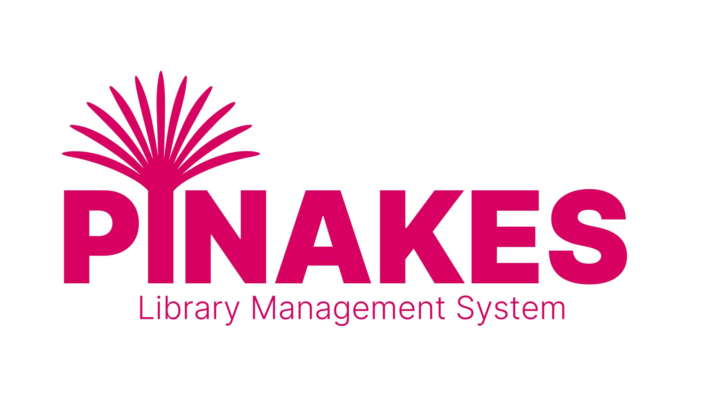

<p align="center">
  
</p>

# Pinakes 📚

> **Open-Source Integrated Library System**
> License: GPL-3  |  Languages: Italian, English

Pinakes is a self-hosted, full-featured ILS for schools, municipalities, and private collections. It focuses on automation, extensibility, and a usable public catalog without requiring a web team.

[](version.json)
[](installer)
[](LICENSE)

[](https://www.php.net/)

[](https://www.mysql.com/)
[](https://developer.mozilla.org/docs/Web/JavaScript)


---

## ⚡ Quick Start

1. **Clone or download** this repository and upload all files to the root directory of your server.
2. **Visit your site's root URL** in the browser — the guided installer starts automatically.
3. **Provide database credentials** (database must be empty).
4. **Select language** (Italian or English).
5. **Configure** organization name, logo, and email notifications.
6. **Create admin account** and start cataloging.

**Email configuration**: Supports both PHP `mail()` and SMTP. Required for notifications to work (loan confirmations, due-date reminders, registration approvals, reservation alerts). Can be configured during installation or later from the admin panel.

All frontend assets are precompiled. Works on shared hosting. No Composer or build tools required on production. All configuration values can be changed later from the admin panel.

---

## Story Behind the Name

**Pinakes** comes from the ancient Greek word *πίνακες* ("tables" or "catalogues"). Callimachus of Cyrene compiled the *Pinakes* around 245 BC for the Library of Alexandria: 120 scrolls that indexed more than 120,000 works with authorship, subject and location. This project borrows that same mission—organising and sharing knowledge with modern tools.

---

## What It Does

Pinakes provides cataloging, circulation, a self-service public frontend, and REST APIs out of the box. It ships with precompiled frontend assets and a guided installer so you can deploy quickly on standard LAMP hosting.

---

## Core Features

### Automatic Metadata Import
- **ISBN/EAN scraping** from Google Books, Open Library, and pluggable sources
- **Automatic cover retrieval** when available
- **Every field editable manually** — automation never locks you in

### Cataloging
- **Multi-copy support** with independent barcodes and statuses for each physical copy
- **Unified records** for physical books, eBooks, and audiobooks
- **Dewey Decimal Classification** preloaded (1,369 categories) with hierarchical browsing
- **CSV bulk import** with field mapping, validation, and automatic ISBN enrichment
- **Automatic duplicate detection** by ID, ISBN13, or EAN (updates existing records without modifying physical copies)
- **Author and publisher management** with dedicated profiles and bibliography views
- **Genre/category system** with custom taxonomies and multi-category assignment
- **Series and collections** tracking with sequential numbering
- **Barcode generation** for physical inventory (Code 128, EAN-13, custom formats)
- **Cover image management** with automatic download, manual upload, and URL import
- **Rich metadata fields** including edition, publication date, language, format, dimensions, weight, page count
- **Keywords and tags** for enhanced searchability and subject indexing
- **Custom notes and annotations** for internal cataloging remarks

### Circulation
- **Full loan workflow**: request, approval, checkout, renewal, return
- **Automatic due-date calculation** with configurable loan periods
- **Configurable renewal rules** (manual or automatic approval)
- **FIFO reservation queues** with availability alerts when items become free
- **Detailed per-user and per-item history** for audit trails

### Catalogue Mode
- **Browse-only option** for libraries that don't need circulation features
- **Configurable during installation** or via Admin → Settings → Advanced
- **Hides all loan-related UI**: request buttons, reservation forms, wishlist
- **Admin sidebar simplified** without loan management menus
- **Perfect for**: digital archives, reference-only collections, museum libraries

### Calendar & ICS Integration
- **Interactive dashboard calendar** (FullCalendar) showing all loans and reservations
- **Color-coded events**: active loans (green), scheduled (blue), overdue (red), pending requests (amber), reservations (purple)
- **Start/end markers** for easy visualization of loan periods
- **Click to view details**: user, book title, dates, and status in modal popup
- **ICS calendar export** for syncing with external calendar apps (Google Calendar, Apple Calendar, Outlook)
- **Automatic ICS generation** via maintenance service or cron job
- **Subscribable calendar URL** that stays updated with latest loans and reservations

### Email Notifications
Automatic emails for:
- New user registration
- Registration approval
- Loan confirmation
- Approaching due dates (configurable days before)
- Overdue reminders
- Item-available notifications for reservations

**WYSIWYG email template editor** with dynamic tags for record, user, and loan data.

### Public Catalog (OPAC)
- **Responsive, multilingual frontend** (Italian + English)
- **AJAX search** with instant results and relevance ranking
- **AJAX filters**: genre, publisher, availability, publication year, format
- **Patrons can leave reviews and ratings** (configurable)
- **Built-in SEO tooling**: sitemap, clean URLs, Schema.org metadata tags
- **Cookie-consent banner** and privacy tools (GDPR-compliant)

### Physical Inventory
- **Hierarchical location model**: shelf, aisle, position
- **Automatic position assignment** for new copies
- **Barcode generation** in standard formats
- **Printable PDF labels** in multiple sizes (customizable templates)

### Digital Content
- **eBook distribution** (PDF, ePub) with download tracking
- **Audiobook streaming** (MP3, M4A, OGG) with integrated player
- **Drag-and-drop upload** or external URL linking

### Plugin System
Extend without modifying core files. Plugins can implement:
- New metadata scrapers (custom APIs, proprietary databases)
- Additional business logic (custom loan rules, notifications)
- Digital-content modules (eBooks, audiobooks, streaming)
- Import/export routines (MARC21, UNIMARC, custom formats)

Plugins support encrypted secrets and isolated configuration. Install via ZIP upload in admin panel.

**Pre-installed plugins** (4 included):
- **Open Library** — Metadata scraping from Open Library + Google Books API
- **Z39 Server** — SRU 1.2 API for catalog interoperability (MARCXML, Dublin Core, MODS)
- **API Book Scraper** — External ISBN enrichment via custom APIs
- **Digital Library** — eBook (PDF, ePub) and audiobook (MP3, M4A, OGG) management with streaming player

**Available as separate download**:
- **Scraping Pro** — Advanced metadata scraping with configurable sources

### CMS and Customization
- **Homepage editor** with drag-and-drop blocks (hero banner, featured shelves, events, testimonials)
- **Custom pages** (About, Regulations, Events) with WYSIWYG editing
- **10 color themes** with instant switching (Sky Blue, Forest Green, Royal Purple, Sunset Orange, Cherry Red, Ocean Teal, Lavender Dreams, Midnight, Coral Sunset, Golden Hour)
- **Custom theme editor** with live preview for primary, secondary, and CTA colors
- **Logo customization** and branding
- **Centralized media manager** for images and documents
- **Event management** with dates, descriptions, and homepage display

### APIs
- **REST API** for search, availability, cataloging, and statistics
- **SRU implementation** for Z39.50-style interoperability (union catalogs, interlibrary loan)
- **CSV and Excel export** for reports and backups
- **PDF generation** for labels, receipts, and reports

### User Management
- **Manual approval** of new registrations (optional)
- **Automatic card number assignment** with customizable prefixes
- **Complete per-user history** of loans and reservations
- **Self-service patron portal** with loan renewal, reservation management, and wishlists

---

## Why It Might Be Useful

- **Fast ISBN-driven cataloging** cuts manual entry to seconds per book
- **Usable public catalog** without needing a web developer or custom theme work
- **Extensible via plugins** if you want custom scrapers, integrations, or business logic
- **Self-hosted and GPL-3 licensed** — full control, no vendor lock-in, no recurring fees
- **Works on shared hosting** — no root access, Docker, or build tools required on production

---

## Installation

1. **Clone the repository**
   ```bash
   git clone https://github.com/fabiodalez-dev/pinakes.git
   cd pinakes
   ```

2. **(Optional) Refresh dependencies locally**
   ```bash
   composer install --no-dev --optimize-autoloader
   cd frontend && npm install && npm run build && cd ..
   ```

3. **Fix writable directories** — Git cannot store 0777 permissions:
   ```bash
   ./bin/setup-permissions.sh
   # or set 777 manually on uploads/, storage/, backups/, public/uploads/
   ```

4. **Start a local server** (or configure your vhost):
   ```bash
   php -S 0.0.0.0:8000 router.php
   ```

5. **Run the web installer** — visit your domain. The installer walks through:
   - Requirement checks (PHP extensions, directory permissions)
   - Database credentials & connection test
   - Schema + sample data import (Dewey, genres, email templates)
   - Admin account creation
   - App + email configuration

   It writes `.env` and `.installed` automatically — no manual file editing needed.

6. **Post-install**
   - Remove/lock the `installer/` directory (button provided on final step)
   - Configure SMTP, registration policy, and CMS blocks from **Admin → Settings**
   - Schedule `php cron/automatic-notifications.php` (daily) for automatic email reminders

---

## Plugins (Pre-installed)

All plugins are located in `storage/plugins/` and can be managed from **Admin → Plugins**.

### 1. Open Library (`open-library-v1.0.0.zip`)
- **Metadata scraping** from Open Library API
- **Fallback to Google Books** when Open Library lacks data
- **Automatic cover download** with validation
- **Subject mapping** and language normalization
- **Configurable priority** and caching options

### 2. Z39 Server (`z39-server-v1.0.0.zip`)
- **SRU 1.2 API** for catalog interoperability
- **Export formats**: MARCXML, Dublin Core, MODS, OAI_DC
- **CQL query parser** for advanced searches
- **Rate limiting** and access logging
- **Union catalog integration** for interlibrary loan systems

### 3. API Book Scraper (`api-book-scraper-v1.0.0.zip`)
- **External API integration** for ISBN enrichment
- **Custom endpoint configuration** (URL, headers, auth)
- **Response mapping** to Pinakes schema
- **Retry logic** with exponential backoff
- **Error logging** and debugging tools

### 4. Digital Library (`digital-library-v1.0.0.zip`)
- **eBook support** (PDF, ePub) with download tracking
- **Audiobook streaming** (MP3, M4A, OGG) with HTML5 player
- **Per-item digital asset management** (unlimited files per book)
- **Access control** (public, logged-in users only, specific roles)
- **Usage statistics** and download history

### 5. Scraping Pro (`scraping-pro-v1.0.0.zip`)
- **Advanced metadata scraping** with configurable sources
- **Custom field mapping** for proprietary databases
- **Bulk enrichment** for existing catalog
- **Priority ordering** for multiple sources
- **Cache management** to reduce API calls

---

## Tech Stack

**Backend**: Slim 4.13, PHP-DI, Slim PSR-7 + CSRF, Monolog 3, PHPMailer 6.10, TCPDF 6.10, Google reCAPTCHA, thepixeldeveloper/sitemap, emleons/sim-rating, vlucas/phpdotenv.

**Frontend**: Webpack 5, Tailwind CSS 3.4.18, Bootstrap 5.3.8, jQuery 3.7.1, DataTables 2.3.x, Chart.js 4.5, SweetAlert2 11, Flatpickr 4.6, Sortable.js 1.15, Choices.js 11, TinyMCE 8, Uppy 4, jsPDF, JSZip, Font Awesome, Inter font (self-hosted).

---

## Deployment

### Apache (Shared Hosting)
Works out of the box. Two `.htaccess` files handle routing:
- **Root `.htaccess`**: Redirects to `/public/` or `/installer/`
- **`public/.htaccess`**: Front controller routing, security headers, CORS

### Nginx (VPS/Dedicated)
Copy `.nginx.conf.example` to your Nginx sites directory:
```bash
sudo cp .nginx.conf.example /etc/nginx/sites-available/pinakes
sudo nano /etc/nginx/sites-available/pinakes  # Edit server_name, root, PHP-FPM
sudo ln -s /etc/nginx/sites-available/pinakes /etc/nginx/sites-enabled/
sudo nginx -t && sudo systemctl reload nginx
```

---

## Support & Contact

📧 **Email**: [pinakes@fabiodalez.it](mailto:pinakes@fabiodalez.it)
🐛 **Issues**: [GitHub Issues](https://github.com/fabiodalez-dev/pinakes/issues)
💬 **Discussions**: [GitHub Discussions](https://github.com/fabiodalez-dev/pinakes/discussions)

---

## Contributing & License

Contributions, issues, and feature requests are welcome via GitHub pull requests. Pinakes is released under the **GNU General Public License v3.0** (see [LICENSE](LICENSE)).

If Pinakes helps your library, please ⭐ the repository!

---

## Handy Paths for Developers

- `app/Views/libri/partials/book_form.php` – Catalog form logic, ISBN ingestion
- `app/Controllers/PrestitiController.php` – Core lending workflows
- `app/Controllers/ReservationsController.php` – Queue handling
- `app/Controllers/UserWishlistController.php` – Wishlist UX
- `app/Views/frontend/catalog.php` – Public catalog filters
- `app/Controllers/SeoController.php` – Sitemap + robots.txt
- `storage/plugins/` – Plugin directory (all pre-installed plugins)
