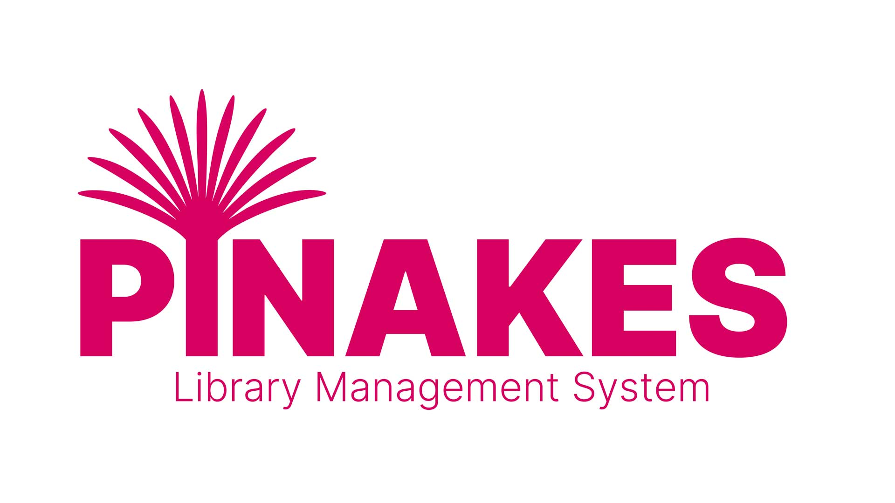
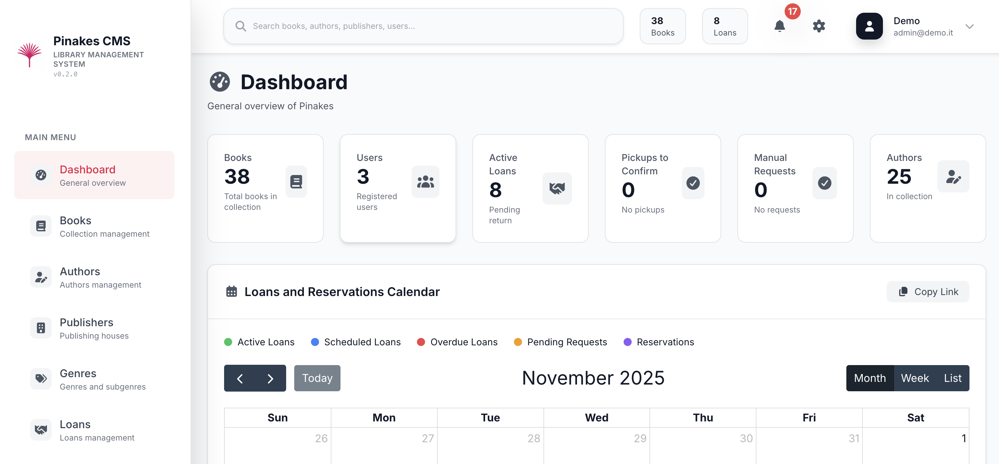
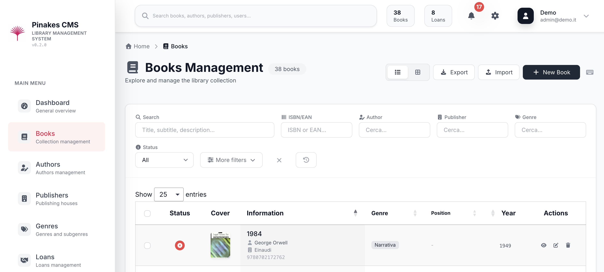
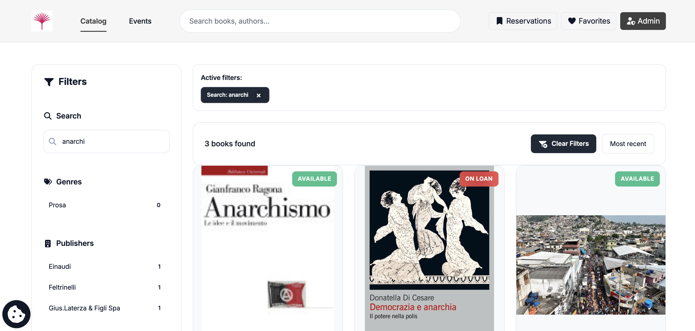

<p align="center">
  
</p>

# Pinakes

> **Open-Source Integrated Library System**
> License: GPL-3  |  Languages: Italian, English, German

Pinakes is a self-hosted, full-featured ILS for schools, municipalities, and private collections. It focuses on automation, extensibility, and a usable public catalog without requiring a web team.

[](version.json)
[](installer)
[](LICENSE)

[](https://www.php.net/)

[](https://www.mysql.com/)
[](https://developer.mozilla.org/docs/Web/JavaScript)


[](https://fabiodalez-dev.github.io/Pinakes/)
[](https://buymeacoffee.com/fabiodalez)

---

## What's New in v0.5.9 (current series, latest patch: v0.5.9.4)

### Archives plugin (ISAD(G) / ISAAR(CPF))

New bundled plugin for archival material alongside the bibliographic
catalog — hierarchical descriptions (Fondo → Series → File → Item) per
[ISAD(G)](https://www.ica.org/en/isadg-general-international-standard-archival-description-second-edition),
authority records per
[ISAAR(CPF)](https://www.ica.org/en/isaar-cpf-international-standard-archival-authority-record-corporate-bodies-persons-and-families-2nd).

- Three tables (`archival_units`, `authority_records`, `archival_unit_authority`)
  with self-referencing tree, FK guards, MARC-like field crosswalk inspired
  by the ABA format (Arbejderbevægelsens Bibliotek og Arkiv).
- Admin CRUD at `/admin/archives`, public frontend at `/archivio` (card grid
  + detail pages styled to match the book detail, SEO slug URLs, JSON-LD
  `ArchiveComponent` schema, breadcrumb chain).
- Per-unit cover image + document uploads (PDF/ePub/MP3/video) with finfo
  MIME detection and path-prefix unlink guard.
- Plugin ships **inactive** (`metadata.optional: true`). Activate in Admin
  → Plugins to create the schema.
- i18n: IT/EN/DE (~40 new keys). Tracks
  [#103](https://github.com/fabiodalez-dev/Pinakes/issues/103).

### Discogs catalog number (Cat#) support

`DiscogsPlugin::validateBarcode` now accepts Catalog Numbers
(`CDP 7912682`, `SRX-6272`, `DGC-24425-2`) alongside EAN-13/UPC-A.
`ScrapeController::byIsbn` preserves the raw identifier through the
`scrape.isbn.validate` hook chain so plugins can match non-numeric
inputs. Valid ISBN-10 codes ending in `X` (`080442957X`) are explicitly
vetoed from Cat# classification to avoid music-metadata merges into book
records (MOD-11 checksum in `DiscogsPlugin::isIsbn10`, 7 regression
asserts in `tests/discogs-catno.unit.php`). Closes
[#101](https://github.com/fabiodalez-dev/Pinakes/issues/101).

### Remember-me preserves user locale

Users whose `utenti.locale` differs from the install default
(a `de_DE` user on an `it_IT` install) now see their locale restored
after auto-login. Fix is in installer seed + a backfill migration:
`installer/database/data_{it_IT,en_US}.sql` seed all three shipped
locales, `migrate_0.5.9.1.sql` adds the missing row on existing
installs. Closes [#108](https://github.com/fabiodalez-dev/Pinakes/issues/108).

### Migration

`migrate_0.5.9.sql` creates archival plugin tables + indexes.
`migrate_0.5.9.1.sql` seeds missing locales. Both idempotent via
`INFORMATION_SCHEMA` guards and `INSERT IGNORE`.

### Release-pipeline hardening (v0.5.9.2 → v0.5.9.4)

The 0.5.9.x series took four hotfix iterations because a forgotten
GitHub Actions workflow (`release.yml`) was racing
`scripts/create-release.sh` and overwriting the published ZIP with a
stale build that only contained 5 of 10 bundled plugins. The rogue
workflow is now disabled, `bin/build-release.sh` enumerates plugins
from the filesystem instead of a hardcoded list, and
`scripts/create-release.sh` verifies the shipped ZIP via the GitHub
API (uploader identity + SHA + plugin count, polled for 90s) so no
third-party overwrite can slip through unnoticed. Full post-mortem
in `updater.md`.

---

## Previous Releases

<details>
<summary><strong>v0.5.4</strong> - Discogs Plugin + Media Type + Plugin Manager Hardening</summary>

### Discogs music scraper plugin (#87)

- **New `tipo_media` ENUM** (`libro/disco/audiolibro/dvd/altro`) on `libri` with composite index `(deleted_at, tipo_media)`
- **Heuristic backfill** from `formato` using anchored LIKE patterns (avoids `%cd%` matching CD-ROM, `%lp%` matching "help")
- **Discogs + MusicBrainz + CoverArtArchive + Deezer** chain with 4 hooks (incl. `scrape.isbn.validate` for UPC-12/13)
- **Barcode → ISBN guard** in `ScrapeController::normalizeIsbnFields` — skips normalization when no format/tipo_media signal to avoid the EAN-in-`isbn13` regression
- **PluginManager** migrated from `error_log` → `SecureLogger` (31 call sites)

### Post-release hotfixes (rolled into v0.5.4)

- `autoRegisterBundledPlugins` INSERT had 14 columns / 13 values after CodeRabbit round 11 — fresh installs crashed with "Column count doesn't match value count" (fixed in `c9bd82c`)
- Same method's `bind_param('ssssssssissss')` had positions 8+9 swapped — `path='discogs'` was cast to int `0`, orphan-detection then deleted the rows (fixed in `fb1e881`)

</details>

<details>
<summary><strong>v0.5.3</strong> - Cross-Version Consistency Fixes (v0.4.9.9–v0.5.2)</summary>

- **`descrizione_plain` propagated** — Catalog FULLTEXT search and admin grid now use `COALESCE(NULLIF(descrizione_plain, ''), descrizione)` for LIKE conditions, completing the HTML-free search feature from v0.4.9.9
- **ISSN in Schema.org & API** — `issn` property now emitted in Book JSON-LD and returned by the public API (`/api/books`)
- **CollaneController atomicity** — `rename()` aborts on `prepare()` failure instead of committing partial state
- **LibraryThing import aligned** — `descrizione_plain` (with `html_entity_decode` + spacing), ISSN normalization, `AuthorNormalizer` on traduttore, soft-delete guards on all UPDATE queries, and `descrizione_plain` column conditional (safe on pre-0.4.9.9 databases)
- **Secondary Author Roles** — LT import now routes translators to `traduttore` field based on `Secondary Author Roles`

</details>

<details>
<summary><strong>v0.5.2</strong> - Name Normalization (#93)</summary>

### Name Normalization for Translators, Illustrators, Curators (#93)

- **`AuthorNormalizer`** applied to translator, illustrator, and curator on create, update, and scraping
- **Client-side normalization** — "Surname, Name" → "Name Surname" for translator/illustrator in book form
- **Shared `normalizeAuthorName()`** JS helper across authors, translator, illustrator

</details>

<details>
<summary><strong>v0.5.1</strong> - ISSN, Series Management, Multi-Volume Works (#75)</summary>

### ISSN, Series Management, Multi-Volume Works (#75)

**ISSN Field:**
- **New ISSN field** on book form with XXXX-XXXX validation (server-side + client-side)
- **Displayed on frontend** book detail and in public API responses
- **Schema.org** `issn` property emitted in JSON-LD

**Series (Collane) Management:**
- **Admin page** `/admin/collane` — List all series with book counts, create, rename, merge, delete
- **Series detail** page — Description editor, book list with volume numbers, autocomplete merge
- **Bulk assign** — Select multiple books and assign to a series from the book list
- **Search autocomplete** — Series name suggestions in merge and bulk assign dialogs
- **Empty series preserved** — Series with no books still appear in the admin list
- **Frontend "Same series"** section — Book detail shows other books in the same series

**Multi-Volume Works:**
- **`volumi` table** — Links parent works to individual volumes with volume numbers
- **Admin UI** — Add/remove volumes via search modal, volume table on book detail
- **Parent work badge** — "This book is volume X of Work Y" badge with link
- **Cycle prevention** — Full ancestor-chain walk prevents circular relationships
- **Create from collana** — One-click creation of parent work from a series page

**Import Improvements:**
- **LibraryThing Series parsing** — Splits `"Series Name ; Number"` into separate collana + numero_serie
- **Scraping series split** — Same parsing for ISBN scraping results
- **CSV/TSV import** — `collana` field already supported with multilingual aliases

**Bug Fixes & Improvements:**
- **ISSN validation** — Explicit error message instead of silent discard
- **Transactions** — Delete, rename, merge collane wrapped in DB transactions
- **Error handling** — execute() results checked in all AJAX endpoints
- **Soft-delete guards** — addVolume rejects deleted books, updateOptionals includes guard
- **Migration resilience** — `hasCollaneTable()` guard for partial migration scenarios
- **Non-numeric volume sorting** — Special volumes sort after numbered ones
- **Unified search fix** — Add-volume modal correctly parses flat array response

</details>

<details>
<summary><strong>v0.5.0</strong> - SEO & LLM Readiness, Schema.org Enrichment, Curator Field</summary>

### SEO & LLM Readiness, Schema.org Enrichment, Curator Field

- **Hreflang alternate tags** on all frontend pages
- **RSS 2.0 feed** at `/feed.xml`
- **Dynamic `/llms.txt`** endpoint (admin-toggleable)
- **Schema.org enrichment** — Book `sameAs`, all author roles, `bookEdition`, conditional `Offer`
- **New `curatore` field** — Database, form, admin detail, Schema.org `editor`
- **CSV column shift fix (#83)**, admin genre display fix (#90)

</details>

<details>
<summary><strong>v0.4.9.9</strong> - Social Sharing, Genre Navigation, Search Improvements</summary>

### Social Sharing, Genre Navigation, Inline PDF Viewer & Search

- **7 sharing providers** — Facebook, X, WhatsApp, Telegram, LinkedIn, Reddit, Pinterest + Email, Copy Link, Web Share API
- **Genre breadcrumb navigation** — Clickable genre hierarchy links that filter by category
- **Inline PDF viewer** — Browser-native `<iframe>` PDF viewer (Digital Library plugin v1.3.0)
- **Description-inclusive search** — New `descrizione_plain` column for HTML-free search
- **RSS icon in footer** — SVG feed icon next to "Powered by Pinakes"
- **Auto-hook registration** — Plugin hooks auto-registered on page load

</details>

<details>
<summary><strong>v0.4.9.8</strong> - Security, Database Integrity & Code Quality</summary>

### Security & Database Integrity

- **SMTP password encryption** — AES-256-CBC at rest using `APP_KEY`
- **isbn10/ean UNIQUE indexes** — Blank values normalized to NULL, duplicates resolved
- **prestiti FK fix** — Foreign key corrected to reference `utenti(id)`
- **Email notification test suite** — 16 Playwright E2E tests covering all email types

</details>

---

## Quick Start

1. **Clone or download** this repository and upload all files to the root directory of your server.
2. **Visit your site's root URL** in the browser — the guided installer starts automatically.
3. **Provide database credentials** (database must be empty).
4. **Select language** (Italian, English, or German).
5. **Configure** organization name, logo, and email notifications.
6. **Create admin account** and start cataloging.

**Email configuration**: Supports both PHP `mail()` and SMTP. Required for notifications to work (loan confirmations, due-date reminders, registration approvals, reservation alerts). Can be configured during installation or later from the admin panel.

**Post-install** (optional but recommended):
- Remove/lock the `installer/` directory (button provided on final step)
- Configure SMTP, registration policy, and CMS blocks from **Admin → Settings**
- Schedule cron jobs for automated tasks:
  ```bash
  # Notifications every hour (8 AM - 8 PM)
  0 8-20 * * * /usr/bin/php /path/to/cron/automatic-notifications.php >> /var/log/biblioteca-cron.log 2>&1

  # Full maintenance at 6 AM (handles reservation/pickup expirations)
  0 6 * * * /usr/bin/php /path/to/cron/full-maintenance.php >> /var/log/biblioteca-maintenance.log 2>&1
  ```

All frontend assets are precompiled. Works on shared hosting. No Composer or build tools required on production. All configuration values can be changed later from the admin panel.

---

## Story Behind the Name

**Pinakes** comes from the ancient Greek word *πίνακες* ("tables" or "catalogues"). Callimachus of Cyrene compiled the *Pinakes* around 245 BC for the Library of Alexandria: 120 scrolls that indexed more than 120,000 works with authorship, subject and location. This project borrows that same mission—organising and sharing knowledge with modern tools.

**Full documentation**: [fabiodalez-dev.github.io/Pinakes](https://fabiodalez-dev.github.io/Pinakes/)

---

## What It Does

Pinakes provides cataloging, circulation, a self-service public frontend, and REST APIs out of the box. It ships with precompiled frontend assets and a guided installer so you can deploy quickly on standard LAMP hosting.

---

## Screenshots

<p align="center">
  <br>
  <em>Admin Dashboard — Loans overview, calendar, and quick stats</em>
</p>

<p align="center">
  <br>
  <em>Book Management — ISBN auto-fill, multi-copy support, cover retrieval</em>
</p>

<p align="center">
  <br>
  <em>Public Catalog (OPAC) — Search, filters, and patron self-service</em>
</p>

---

## Core Features

### Automatic Metadata Import
- **ISBN/EAN scraping** from Google Books, Open Library, and pluggable sources
- **Automatic cover retrieval** when available
- **Every field editable manually** — automation never locks you in

### Cataloging
- **Multi-copy support** with independent barcodes and statuses for each physical copy
- **Unified records** for physical books, eBooks, and audiobooks
- **Dewey Decimal Classification** with 1,200+ preset categories (IT/EN), hierarchical browsing, manual entry for custom codes, and auto-population from SBN scraping
- **CSV bulk import** with field mapping, validation, automatic ISBN enrichment, and Dewey classification from scraping
- **LibraryThing TSV import** with flexible column mapping for 29 custom fields and automatic metadata enrichment
- **Import history** — Admin panel with per-import statistics, error reports downloadable as CSV, and log retention management
- **Automatic duplicate detection** by ID, ISBN13, EAN, or title+author (updates existing records without modifying physical copies)
- **Author and publisher management** with dedicated profiles and bibliography views
- **Genre/category system** with custom taxonomies and multi-category assignment
- **Series and collections** tracking with sequential numbering
- **Barcode generation** for physical inventory (Code 128, EAN-13, custom formats)
- **Cover image management** with automatic download, manual upload, and URL import
- **Rich metadata fields** including edition, publication date, language, format, dimensions, weight, page count
- **Keywords and tags** for enhanced searchability and subject indexing
- **Custom notes and annotations** for internal cataloging remarks

### Circulation
- **Full loan workflow**: request, approval, checkout, renewal, return
- **Automatic due-date calculation** with configurable loan periods
- **Configurable renewal rules** (manual or automatic approval)
- **FIFO reservation queues** with availability alerts when items become free
- **Detailed per-user and per-item history** for audit trails

### Catalogue Mode
- **Browse-only option** for libraries that don't need circulation features
- **Configurable during installation** or via Admin → Settings → Advanced
- **Hides all loan-related UI**: request buttons, reservation forms, wishlist
- **Admin sidebar simplified** without loan management menus
- **Perfect for**: digital archives, reference-only collections, museum libraries

### Pickup Confirmation System
- **New `ready_for_pickup` state** — Approved loans enter "Ready for Pickup" before becoming active
- **Two-step workflow** — Admin approves → Patron picks up → Admin confirms pickup
- **Configurable pickup deadline** — Days allowed for pickup (Settings → Loans, default: 3 days)
- **Cancel pickup** — Admin can cancel uncollected loans, freeing copy and advancing reservation queue
- **Automatic queue advancement** — Next patron notified immediately when pickup is cancelled
- **Works without cron** — Real-time queue processing, no maintenance service dependency
- **Visual indicators** — Orange badge for "Ready for Pickup" in all loan views
- **Calendar integration** — `ready_for_pickup` periods shown in orange, block availability for other reservations
- **Origin tracking** — System tracks whether loans originated from reservations or manual creation

### Calendar & ICS Integration
- **Interactive dashboard calendar** (FullCalendar) showing all loans and reservations
- **Color-coded events**: active loans (green), scheduled (blue), overdue (red), pending requests (amber), reservations (purple)
- **Start/end markers** for easy visualization of loan periods
- **Click to view details**: user, book title, dates, and status in modal popup
- **ICS calendar export** for syncing with external calendar apps (Google Calendar, Apple Calendar, Outlook)
- **Automatic ICS generation** via maintenance service or cron job
- **Subscribable calendar URL** that stays updated with latest loans and reservations

### Email Notifications
Automatic emails for:
- New user registration
- Registration approval
- Loan confirmation
- Approaching due dates (configurable days before)
- Overdue reminders
- Item-available notifications for reservations

**WYSIWYG email template editor** with dynamic tags for record, user, and loan data.

### Public Catalog (OPAC)
- **Responsive, multilingual frontend** (Italian, English, German)
- **AJAX search** with instant results and relevance ranking
- **AJAX filters**: genre, publisher, availability, publication year, format
- **Patrons can leave reviews and ratings** (configurable)
- **Built-in SEO tooling**: sitemap, clean URLs, Schema.org JSON-LD (Book, BreadcrumbList, Event), hreflang tags, RSS 2.0 feed, `/llms.txt` for AI crawlers
- **Cookie-consent banner** and privacy tools (GDPR-compliant)

### Dewey Decimal Classification
- **1,200+ preset categories** in Italian and English loaded from JSON files
- **Hierarchical browsing** — Navigate from main classes (000-999) to subdivisions (e.g., 599.9 Mammals)
- **Manual entry** — Accept any valid Dewey code, not limited to preset list
- **Format validation** — Real-time validation of code format (XXX.XXXX)
- **Automatic population from SBN** — Dewey codes extracted during ISBN scraping are auto-added to the database
- **Multi-language** — Separate JSON files for IT/EN with full translations
- **Dewey Editor plugin** — Visual tree editor for managing classifications with import/export
- **No database table** — Data loaded from `data/dewey/` JSON files at runtime

### Auto-Updater
- **Built-in update system** — Check, download, and install updates from Admin → Updates
- **Manual ZIP upload** — Upload `.zip` release packages for air-gapped or rate-limited environments
- **Automatic database backup** — Full MySQL dump before every update
- **Safe file updates** — Protected paths (.env, uploads, storage) are never overwritten
- **Database migrations** — Automatic execution of SQL migrations for version jumps
- **Atomic rollback** — Automatic restore on error with pre-update backup
- **Orphan cleanup** — Files removed in new versions are deleted from installation
- **OpCache reset** — Automatic cache invalidation after file updates
- **Security** — CSRF validation, admin-only access, path traversal protection, Zip Slip prevention
- **GitHub API token** — Optional personal access token (Admin → Updates) to raise GitHub API rate limits from 60 to 5,000 req/hr

### Physical Inventory
- **Hierarchical location model**: shelf, aisle, position
- **Automatic position assignment** for new copies
- **Barcode generation** in standard formats
- **Printable PDF labels** in multiple sizes (customizable templates)

### Digital Content
- **eBook distribution** (PDF, ePub) with download tracking
- **Audiobook streaming** (MP3, M4A, OGG) with integrated player
- **Drag-and-drop upload** or external URL linking

### Archival Records — ISAD(G) + ISAAR(CPF)

Shipped as the bundled **Archives** plugin (opt-in; activate from Admin → Plugins). Lets the same Pinakes install manage both a book catalogue *and* a hierarchical archive — fonds, series, files, items — according to the international archival standards used by public archives, historical societies, photographic collections, and academic repositories.

**Hierarchical archival description (ISAD(G) 2nd ed.)**
- Four-level hierarchy: `fonds` → `series` → `file` → `item`. Each row is a standalone ISAD(G) record with `parent_id` chaining up to an arbitrary depth (real archives are usually 2-4 deep).
- Full identity area (3.1): reference code, institution code, formal + constructed title, date range (start/end + predominant dates + significant gaps), extent, language codes.
- Context & content (3.2-3.3): archival history, acquisition source, scope & content, appraisal/destruction schedule, accruals policy, system of arrangement.
- Access & use (3.4): access conditions, reproduction rules, language/script notes, physical characteristics, finding aids.
- Allied materials (3.5): originals/copies location, related units.
- Soft-delete aligned with the library-side `libri` convention (deleted rows vanish from views, still queryable for restore).
- Descendant-cycle guard: an edit that would make a unit its own descendant is rejected with a validation error (walks ancestors up to 100 hops).

**Authority records (ISAAR(CPF))**
- Dedicated table, separate from `autori`, because ISAAR covers persons **and** corporate bodies **and** families — a richer element set than bibliographic authors.
- Identity (5.1): type, authorised form, parallel forms, other forms, identifiers (VIAF / ISNI / ORCID).
- Context (5.2): dates of existence, history, places, legal status, functions/occupations, mandates, internal structure/genealogy, general context, gender.
- M:N linking to archival units with MARC-aligned roles: `creator` / `subject` / `recipient` / `custodian` / `associated`.
- Cross-reconciliation with the library-side `autori` table via `autori_authority_link` — unifies books and archives under a single person/entity in the public search.

**Photographic & audio-visual materials (ABA billedmarc)**
- `specific_material` ENUM with 15 ABA codes: text (bf), photograph (hf), poster (hp), postcard (hm), drawing (hd), map (hk), picture (hb), 3D object/realia (ho), audio recording (lm), motion-picture film (lf), video (vm), microform (bm), electronic/born-digital (le), mixed materials (zz), other.
- Dedicated columns for colour mode (bw / colour / mixed), dimensions, photographer, publisher, collection name, local classification — matching the MARC 300/337/338 content/media/carrier vocabulary.

**MARCXML import/export + SRU endpoint**
- **Export**: `GET /admin/archives/{id}/export.xml` and `GET /admin/archives/export.xml?ids=…` emit ABA-crosswalk MARCXML via XMLWriter. Authorities exported as 100/110/600/610/700/710 tags depending on `(type, role)`.
- **Import**: `POST /admin/archives/import` parses MARCXML (SimpleXML) with optional XSD validation against the Library of Congress MARC21 Slim v1.1 schema. UPSERT on `(institution_code, reference_code)` — re-importing the same file is idempotent. Dry-run preview available.
- **SRU 1.2 read-only endpoint**: `GET /api/archives/sru` — supports `explain`, `searchRetrieve` (CQL subset: `title`, `reference`, `level`, `anywhere`, joined with `AND`), and `scan` stub. External catalogues (Reindex, Koha, ARKIS) can federate-search the archive using MARCXML records.

**Unified cross-entity search**
- `/admin/archives/search` hits three sources in a single query: `archival_units` (FULLTEXT on title + scope + archival_history), `authority_records` (FULLTEXT on authorised_form + history + functions), and `autori` rows reconciled to an authority.

**Plugin integration**
- Self-contained at `storage/plugins/archives/`. Wires up through two `plugin_hooks` rows (`app.routes.register`, `admin.menu.render`) on activation; deactivation removes the route + sidebar entry without touching DB data.
- Full i18n (IT/EN/DE) with ICA-ISAD(G) terminology (IT) / ICA (EN) / ICA-Deutsch (DE: Bestand / Signatur / Einzelstück).
- Migration `migrate_0.5.9.sql` is fully idempotent (INFORMATION_SCHEMA guards + conditional ALTERs) — safe to re-run on partial installs, cleanly extends the ENUM on upgrades.

### Plugin System
Extend without modifying core files. Plugins can implement:
- New metadata scrapers (custom APIs, proprietary databases)
- Additional business logic (custom loan rules, notifications)
- Digital-content modules (eBooks, audiobooks, streaming)
- Import/export routines (MARC21, UNIMARC, custom formats)

Plugins support encrypted secrets and isolated configuration. Install via ZIP upload in admin panel.

**Pre-installed plugins** (6 included):
- **Open Library** — Metadata scraping from Open Library + Google Books API
- **Z39 Server** — SRU 1.2 API + SBN client for Italian library metadata with Dewey extraction
- **API Book Scraper** — External ISBN enrichment via custom APIs
- **Digital Library** — eBook (PDF, ePub) and audiobook (MP3, M4A, OGG) management with streaming player
- **Dewey Editor** — Visual editor for Dewey classification data with import/export and validation
- **Archives** — ISAD(G) hierarchical archival records + ISAAR(CPF) authority records with MARCXML import/export, SRU 1.2 endpoint, photographic material support (ABA billedmarc), and unified cross-entity search bridging books + archives. Opt-in (`is_active=0` on install)

### CMS and Customization
- **Homepage editor** with drag-and-drop blocks (hero banner, featured shelves, events, testimonials)
- **Custom pages** (About, Regulations, Events) with WYSIWYG editing
- **10 color themes** with instant switching (Sky Blue, Forest Green, Royal Purple, Sunset Orange, Cherry Red, Ocean Teal, Lavender Dreams, Midnight, Coral Sunset, Golden Hour)
- **Custom theme editor** with live preview for primary, secondary, and CTA colors
- **Logo customization** and branding
- **Centralized media manager** for images and documents
- **Event management** with dates, descriptions, and homepage display

### APIs
- **REST API** for search, availability, cataloging, and statistics
- **SRU 1.2 protocol** at `/api/sru` — standard library interoperability (MARCXML, Dublin Core, MODS export)
- **Z39.50 client** for copy cataloging from external catalogs (Library of Congress, OCLC, national libraries)
- **CSV and Excel export** for reports and backups
- **PDF generation** for labels, receipts, and reports

### User Management
- **Manual approval** of new registrations (optional)
- **Automatic card number assignment** with customizable prefixes
- **Complete per-user history** of loans and reservations
- **Self-service patron portal** with loan renewal, reservation management, and wishlists

---

## Why It Might Be Useful

- **Fast ISBN-driven cataloging** cuts manual entry to seconds per book
- **Usable public catalog** without needing a web developer or custom theme work
- **Extensible via plugins** if you want custom scrapers, integrations, or business logic
- **Self-hosted and GPL-3 licensed** — full control, no vendor lock-in, no recurring fees
- **Works on shared hosting** — no root access, Docker, or build tools required on production

---

## Plugins (Pre-installed)

All plugins are located in `storage/plugins/` and can be managed from **Admin → Plugins**.

### 1. Open Library (`open-library-v1.0.1.zip`)
- **Metadata scraping** from Open Library API
- **Fallback to Google Books** when Open Library lacks data
- **Automatic cover download** with validation
- **Subject mapping** and language normalization
- **Configurable priority** and caching options

### 2. Z39 Server (`z39-server-v1.2.3.zip`)

Implements the **SRU (Search/Retrieve via URL)** protocol, the HTTP-based successor to Z39.50, enabling catalog interoperability with library systems worldwide.

**Server Mode** (expose your catalog):
- **SRU 1.2 API** at `/api/sru` with explain, searchRetrieve, scan operations
- **Export formats**: MARCXML, Dublin Core, MODS, OAI_DC
- **CQL query parser** supporting indexes: `dc.title`, `dc.creator`, `dc.subject`, `bath.isbn`, `dc.publisher`, `dc.date`
- **Rate limiting** (100 req/hour per IP) and comprehensive access logging
- **Optional API key authentication** via `X-API-Key` header
- **Trusted proxy support** for deployments behind load balancers (CIDR notation)

**Client Mode** (import from external catalogs):
- **Copy cataloging** from Z39.50/SRU servers (Library of Congress, OCLC, K10plus, SUDOC, national libraries)
- **SBN Italia client** — Automatic metadata retrieval from Italian national library catalog
- **Dewey classification extraction**:
  - SBN: Parses Dewey codes from `classificazioneDewey` field (format: `335.4092 (19.) SISTEMI MARXIANI`)
  - SRU/MARCXML: Extracts from MARC field 082 (Dewey Decimal Classification Number)
  - Dublin Core: Parses from `dc:subject` (DDC scheme) and `dc:coverage` fields
- **Federated search** across multiple configured servers
- **Automatic retry** with exponential backoff (100ms, 200ms, 400ms)
- **TLS certificate validation** for secure connections
- **MARCXML and Dublin Core parsing** with author extraction (MARC 100/700 fields)

**Example queries**:
```bash
# Server info
curl "http://yoursite.com/api/sru?operation=explain"

# Search by author
curl "http://yoursite.com/api/sru?operation=searchRetrieve&query=dc.creator=marx&maximumRecords=10"

# Search by ISBN (Dublin Core format)
curl "http://yoursite.com/api/sru?operation=searchRetrieve&query=bath.isbn=9788842058946&recordSchema=dc"
```

**Use cases**: Union catalogs, interlibrary loan systems, OPAC federation, copy cataloging workflows, automatic Dewey classification.

### 3. API Book Scraper (`api-book-scraper-v1.1.1.zip`)
- **External API integration** for ISBN enrichment
- **Custom endpoint configuration** (URL, headers, auth)
- **Response mapping** to Pinakes schema
- **Retry logic** with exponential backoff
- **Error logging** and debugging tools

### 4. Digital Library (`digital-library-v1.3.0.zip`)
- **eBook support** (PDF, ePub) with download tracking
- **Audiobook streaming** (MP3, M4A, OGG) with HTML5 player
- **Per-item digital asset management** (unlimited files per book)
- **Access control** (public, logged-in users only, specific roles)
- **Usage statistics** and download history

### 5. Dewey Editor (`dewey-editor-v1.0.1.zip`)

Complete Dewey Decimal Classification management system with multilingual support, automatic population, and data exchange capabilities.

**Core Features**:
- **Tree-based visual editor** — Navigate and edit the complete Dewey hierarchy (1,200+ preset entries)
- **Multi-language support** — Separate JSON files for Italian (`dewey_completo_it.json`) and English (`dewey_completo_en.json`) with full translations
- **Inline editing** — Add, modify, or delete categories with instant validation
- **Validation engine** — Checks code format (XXX.XXXX), hierarchy consistency, and duplicate detection

**Data Exchange**:
- **JSON import/export** — Backup and restore classification data for manual editing or exchange with other Pinakes installations
- **Cross-installation sharing** — Export your customized Dewey database and import it into another Pinakes instance
- **Merge capability** — Import external classifications while preserving existing entries

**Automatic Dewey Scraping**:
- **SBN integration** — When scraping book metadata from SBN (Italian National Library), Dewey codes are automatically extracted from the `classificazioneDewey` field
- **SRU/Z39.50 servers** — Dewey codes extracted from MARC field 082 when querying external catalogs (K10plus, SUDOC, Library of Congress, etc.)
- **Auto-population** — New Dewey codes discovered during scraping are automatically added to your JSON database (language-aware: only updates when source language matches app locale)
- **CSV import enrichment** — Books imported via CSV are automatically enriched with Dewey classification through ISBN scraping

**Dewey Code Format**:
- Main classes: `000`-`999` (3 digits)
- Subdivisions: `000.1` to `999.9999` (up to 4 decimal places)
- Examples: `599.9` (Mammiferi/Mammals), `004.6782` (Cloud computing), `641.5945` (Cucina italiana/Italian cuisine)

**Book Form Integration**:
- **Chip-based selection** — Selected Dewey code displays as removable chip with code + name
- **Manual entry** — Accept any valid Dewey code (not limited to predefined list)
- **Hierarchical navigation** — Optional collapsible "Browse categories" for discovering codes
- **Breadcrumb display** — Shows full classification path (e.g., "500 → 590 → 599 → 599.9")
- **Frontend validation** — Real-time format validation before submission

---

## Tech Stack

**Backend**: Slim 4.13, PHP-DI, Slim PSR-7 + CSRF, Monolog 3, PHPMailer 6.10, TCPDF 6.10, Google reCAPTCHA, thepixeldeveloper/sitemap, emleons/sim-rating, vlucas/phpdotenv.

**Frontend**: Webpack 5, Tailwind CSS 3.4.18, Bootstrap 5.3.8, jQuery 3.7.1, DataTables 2.3.x, Chart.js 4.5, SweetAlert2 11, Flatpickr 4.6, Sortable.js 1.15, Choices.js 11, TinyMCE 8, Uppy 4, jsPDF, JSZip, Font Awesome, Inter font (self-hosted).

---

## Deployment

### Apache (Shared Hosting)
Works out of the box. Two `.htaccess` files handle routing:
- **Root `.htaccess`**: Redirects to `/public/` or `/installer/`
- **`public/.htaccess`**: Front controller routing, security headers, CORS

### Nginx (VPS/Dedicated)
Copy `.nginx.conf.example` to your Nginx sites directory:
```bash
sudo cp .nginx.conf.example /etc/nginx/sites-available/pinakes
sudo nano /etc/nginx/sites-available/pinakes  # Edit server_name, root, PHP-FPM
sudo ln -s /etc/nginx/sites-available/pinakes /etc/nginx/sites-enabled/
sudo nginx -t && sudo systemctl reload nginx
```

---

## Support & Contact

- **Email**: [pinakes@fabiodalez.it](mailto:pinakes@fabiodalez.it)
- **Issues**: [GitHub Issues](https://github.com/fabiodalez-dev/pinakes/issues)
- **Discussions**: [GitHub Discussions](https://github.com/fabiodalez-dev/pinakes/discussions)

---

## Contributing & License

Contributions, issues, and feature requests are welcome via GitHub pull requests. Pinakes is released under the **GNU General Public License v3.0** (see [LICENSE](LICENSE)).

If Pinakes helps your library, please ⭐ the repository!

---

## Handy Paths for Developers

- `app/Views/libri/partials/book_form.php` – Catalog form logic, ISBN ingestion
- `app/Controllers/PrestitiController.php` – Core lending workflows
- `app/Controllers/LoanApprovalController.php` – Loan approval, pickup confirmation, cancellation
- `app/Controllers/ReservationsController.php` – Queue handling
- `app/Services/ReservationReassignmentService.php` – Queue advancement on returns/cancellations
- `app/Controllers/UserWishlistController.php` – Wishlist UX
- `app/Views/frontend/catalog.php` – Public catalog filters
- `app/Controllers/SeoController.php` – Sitemap + robots.txt
- `app/Controllers/FeedController.php` – RSS 2.0 feed
- `app/Support/HreflangHelper.php` – Hreflang alternate URL generation
- `storage/plugins/` – Plugin directory (all pre-installed plugins)

---

## Community Projects

- **[jbenamy/pinakes-docker](https://github.com/jbenamy/pinakes-docker)** — Community-maintained Docker image. This is an independent project not managed by the Pinakes team — please refer to its own documentation for setup and support.

---

## Support

If you find Pinakes useful, consider supporting the project:

<a href="https://buymeacoffee.com/fabiodalez" target="_blank" rel="noopener noreferrer"></a>
