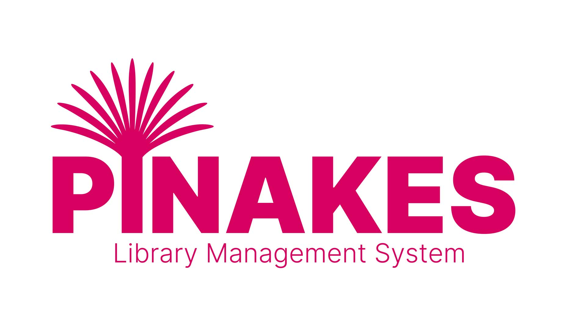
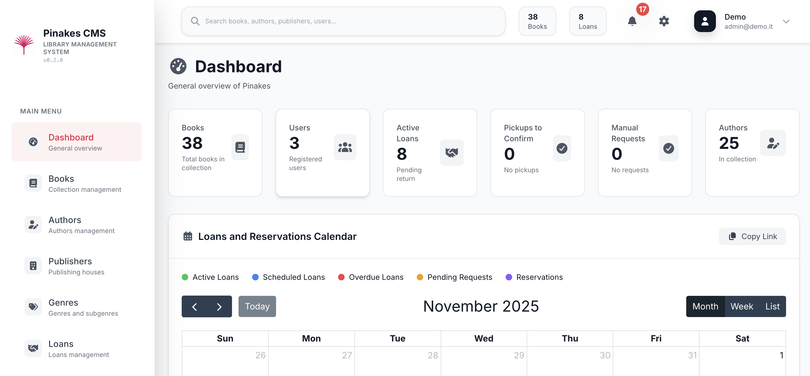
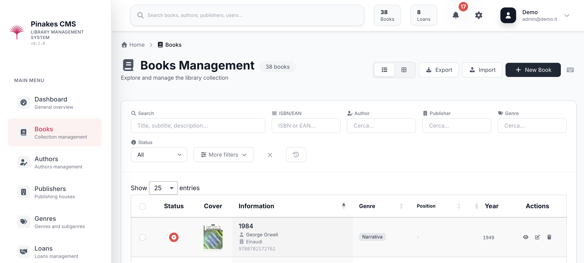
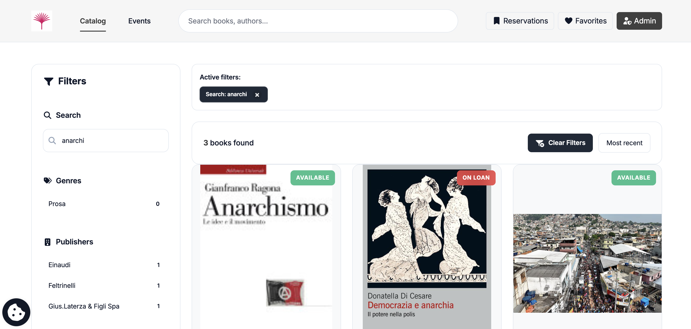

<p align="center">
  
</p>

# Pinakes

> **Open-Source Integrated Library System**
> License: GPL-3  |  Languages: Italian, English, French, German

Pinakes is a self-hosted, full-featured ILS for schools, municipalities, and private collections. It focuses on automation, extensibility, and a usable public catalog without requiring a web team.

📱 **Pinakes ships with a free companion [Android app](https://github.com/fabiodalez-dev/Pinakes-Android).** Enable the bundled Mobile API plugin, point the app at your instance URL, and your members can browse the catalog, check real availability, borrow &amp; reserve, read ebooks / listen to audiobooks, and manage their loans from the phone.

[](version.json)
[](installer)
[](LICENSE)

[](https://www.php.net/)

[](https://www.mysql.com/)
[](https://developer.mozilla.org/docs/Web/JavaScript)


[](https://github.com/fabiodalez-dev/Pinakes-Android)
[](https://fabiodalez-dev.github.io/Pinakes/)
[](https://buymeacoffee.com/fabiodalez)

---

## Requirements

- **PHP 8.2 or higher** — matches `composer.json` (`^8.2`); the installer and the in-app updater enforce this floor.
- **MySQL 5.7+** or **MariaDB 10.3+**
- **PHP extensions**: PDO, PDO MySQL, MySQLi, Mbstring, JSON, GD, Fileinfo, Zip
- **Web server**: Apache (`mod_rewrite` + `.htaccess`) or nginx
- No Composer or Node build tools are needed on the production host — frontend assets are precompiled and `vendor/` ships inside the release ZIP.

---

## What's New

Highlights of the latest release are below. The full version-by-version history (v0.7.59 → v0.6.x) lives in **[CHANGELOG.md](CHANGELOG.md)**.

### v0.7.76 — latest

A follow-up fix: backfilled loan history now includes the physical copy's inventory number, completing the timeline shipped in 0.7.75.

### v0.7.75

A follow-up fix: the activity timeline introduced in 0.7.73 now backfills the existing circulation history, so books already on loan show their events right after the upgrade instead of an empty timeline.

## Quick Start

1. **Clone or download** this repository and upload all files to the root directory of your server.
2. **Visit your site's root URL** in the browser — the guided installer starts automatically.
3. **Provide database credentials** (database must be empty).
4. **Select language** (Italian, English, French, or German).
5. **Configure** organization name, logo, and email notifications.
6. **Create admin account** and start cataloging.

**Email configuration**: Supports both PHP `mail()` and SMTP. Required for notifications to work (loan confirmations, due-date reminders, registration approvals, reservation alerts). Can be configured during installation or later from the admin panel.

**Post-install** (optional but recommended):
- Remove/lock the `installer/` directory (button provided on final step)
- Configure SMTP, registration policy, and CMS blocks from **Admin → Settings**
- Schedule cron jobs for automated tasks:
  ```bash
  # Notifications every hour (8 AM - 8 PM)
  0 8-20 * * * /usr/bin/php /path/to/cron/automatic-notifications.php >> /var/log/biblioteca-cron.log 2>&1

  # Full maintenance at 6 AM (handles reservation/pickup expirations)
  0 6 * * * /usr/bin/php /path/to/cron/full-maintenance.php >> /var/log/biblioteca-maintenance.log 2>&1
  ```

All frontend assets are precompiled. Works on shared hosting. No Composer or build tools required on production. All configuration values can be changed later from the admin panel.

---

## Story Behind the Name

**Pinakes** comes from the ancient Greek word *πίνακες* ("tables" or "catalogues"). Callimachus of Cyrene compiled the *Pinakes* around 245 BC for the Library of Alexandria: 120 scrolls that indexed more than 120,000 works with authorship, subject and location. This project borrows that same mission—organising and sharing knowledge with modern tools.

**Full documentation**: [fabiodalez-dev.github.io/Pinakes](https://fabiodalez-dev.github.io/Pinakes/)

---

## What It Does

Pinakes provides cataloging, circulation, a self-service public frontend, and REST APIs out of the box. It ships with precompiled frontend assets and a guided installer so you can deploy quickly on standard LAMP hosting.

---

## Screenshots

<p align="center">
  <br>
  <em>Admin Dashboard — Loans overview, calendar, and quick stats</em>
</p>

<p align="center">
  <br>
  <em>Book Management — ISBN auto-fill, multi-copy support, cover retrieval</em>
</p>

<p align="center">
  <br>
  <em>Public Catalog (OPAC) — Search, filters, and patron self-service</em>
</p>

---

## Core Features

### Automatic Metadata Import
- **ISBN/EAN scraping** from Google Books, Open Library, and pluggable sources
- **Automatic cover retrieval** when available
- **Every field editable manually** — automation never locks you in

### Cataloging
- **Multi-copy support** with independent barcodes and statuses for each physical copy
- **Unified records** for physical books, eBooks, and audiobooks
- **Dewey Decimal Classification** with 1,200+ preset categories (IT/EN), hierarchical browsing, manual entry for custom codes, and auto-population from SBN scraping
- **CSV bulk import** with field mapping, validation, automatic ISBN enrichment, and Dewey classification from scraping
- **LibraryThing TSV import** with flexible column mapping for 29 custom fields and automatic metadata enrichment
- **Import history** — Admin panel with per-import statistics, error reports downloadable as CSV, and log retention management
- **Automatic duplicate detection** by ID, ISBN13, EAN, or title+author (updates existing records without modifying physical copies)
- **Author and publisher management** with dedicated profiles and bibliography views
- **Genre/category system** with custom taxonomies and multi-category assignment
- **Series and collections** tracking with sequential numbering
- **Barcode generation** for physical inventory (Code 128, EAN-13, custom formats)
- **Cover image management** with automatic download, manual upload, and URL import
- **Rich metadata fields** including edition, publication date, language, format, dimensions, weight, page count
- **Keywords and tags** for enhanced searchability and subject indexing
- **Custom notes and annotations** for internal cataloging remarks

### Circulation
- **Full loan workflow**: request, approval, checkout, renewal, return
- **Automatic due-date calculation** with configurable loan periods
- **Configurable renewal rules** (manual or automatic approval)
- **FIFO reservation queues** with availability alerts when items become free
- **Detailed per-user and per-item history** for audit trails

### Catalogue Mode
- **Browse-only option** for libraries that don't need circulation features
- **Configurable during installation** or via Admin → Settings → Advanced
- **Hides all loan-related UI**: request buttons, reservation forms, wishlist
- **Admin sidebar simplified** without loan management menus
- **Perfect for**: digital archives, reference-only collections, museum libraries

### Pickup Confirmation System
- **New `ready_for_pickup` state** — Approved loans enter "Ready for Pickup" before becoming active
- **Two-step workflow** — Admin approves → Patron picks up → Admin confirms pickup
- **Configurable pickup deadline** — Days allowed for pickup (Settings → Loans, default: 3 days)
- **Cancel pickup** — Admin can cancel uncollected loans, freeing copy and advancing reservation queue
- **Automatic queue advancement** — Next patron notified immediately when pickup is cancelled
- **Works without cron** — Real-time queue processing, no maintenance service dependency
- **Visual indicators** — Orange badge for "Ready for Pickup" in all loan views
- **Calendar integration** — `ready_for_pickup` periods shown in orange, block availability for other reservations
- **Origin tracking** — System tracks whether loans originated from reservations or manual creation

### Calendar & ICS Integration
- **Interactive dashboard calendar** (FullCalendar) showing all loans and reservations
- **Color-coded events**: active loans (green), scheduled (blue), overdue (red), pending requests (amber), reservations (purple)
- **Start/end markers** for easy visualization of loan periods
- **Click to view details**: user, book title, dates, and status in modal popup
- **ICS calendar export** for syncing with external calendar apps (Google Calendar, Apple Calendar, Outlook)
- **Automatic ICS generation** via maintenance service or cron job
- **Subscribable calendar URL** that stays updated with latest loans and reservations

### Email Notifications
Automatic emails for:
- New user registration
- Registration approval
- Loan confirmation
- Approaching due dates (configurable days before)
- Overdue reminders
- Item-available notifications for reservations

**WYSIWYG email template editor** with dynamic tags for record, user, and loan data.

### Public Catalog (OPAC)
- **Responsive, multilingual frontend** (Italian, English, French, German)
- **AJAX search** with instant results and relevance ranking
- **AJAX filters**: genre, publisher, availability, publication year, format
- **Patrons can leave reviews and ratings** (configurable)
- **Built-in SEO tooling**: sitemap, clean URLs, Schema.org JSON-LD (Book, BreadcrumbList, Event), hreflang tags, RSS 2.0 feed, `/llms.txt` for AI crawlers
- **Cookie-consent banner** and privacy tools (GDPR-compliant)

### Dewey Decimal Classification
- **1,200+ preset categories** in Italian and English loaded from JSON files
- **Hierarchical browsing** — Navigate from main classes (000-999) to subdivisions (e.g., 599.9 Mammals)
- **Manual entry** — Accept any valid Dewey code, not limited to preset list
- **Format validation** — Real-time validation of code format (XXX.XXXX)
- **Automatic population from SBN** — Dewey codes extracted during ISBN scraping are auto-added to the database
- **Multi-language** — Separate JSON files for IT/EN with full translations
- **Dewey Editor plugin** — Visual tree editor for managing classifications with import/export
- **No database table** — Data loaded from `data/dewey/` JSON files at runtime

### Auto-Updater
- **Built-in update system** — Check, download, and install updates from Admin → Updates
- **Manual ZIP upload** — Upload `.zip` release packages for air-gapped or rate-limited environments
- **Automatic database backup** — Full MySQL dump before every update
- **Safe file updates** — Protected paths (.env, uploads, storage) are never overwritten
- **Database migrations** — Automatic execution of SQL migrations for version jumps
- **Atomic rollback** — Automatic restore on error with pre-update backup
- **Orphan cleanup** — Files removed in new versions are deleted from installation
- **OpCache reset** — Automatic cache invalidation after file updates
- **Security** — CSRF validation, admin-only access, path traversal protection, Zip Slip prevention
- **GitHub API token** — Optional personal access token (Admin → Updates) to raise GitHub API rate limits from 60 to 5,000 req/hr

### Physical Inventory
- **Hierarchical location model**: shelf, aisle, position
- **Automatic position assignment** for new copies
- **Barcode generation** in standard formats
- **Printable PDF labels** in multiple sizes (customizable templates)

### Digital Content
- **eBook distribution** (PDF, ePub) with download tracking
- **Audiobook streaming** (MP3, M4A, OGG) with integrated player
- **Drag-and-drop upload** or external URL linking

### Archival Records — ISAD(G) + ISAAR(CPF)

Shipped as the bundled **Archives** plugin (opt-in; activate from Admin → Plugins). Lets the same Pinakes install manage both a book catalogue *and* a hierarchical archive — fonds, series, files, items — according to the international archival standards used by public archives, historical societies, photographic collections, and academic repositories.

**Hierarchical archival description (ISAD(G) 2nd ed.)**
- Four-level hierarchy: `fonds` → `series` → `file` → `item`. Each row is a standalone ISAD(G) record with `parent_id` chaining up to an arbitrary depth (real archives are usually 2-4 deep).
- Full identity area (3.1): reference code, institution code, formal + constructed title, date range (start/end + predominant dates + significant gaps), extent, language codes.
- Context & content (3.2-3.3): archival history, acquisition source, scope & content, appraisal/destruction schedule, accruals policy, system of arrangement.
- Access & use (3.4): access conditions, reproduction rules, language/script notes, physical characteristics, finding aids.
- Allied materials (3.5): originals/copies location, related units.
- Soft-delete aligned with the library-side `libri` convention (deleted rows vanish from views, still queryable for restore).
- Descendant-cycle guard: an edit that would make a unit its own descendant is rejected with a validation error (walks ancestors up to 100 hops).

**Authority records (ISAAR(CPF))**
- Dedicated table, separate from `autori`, because ISAAR covers persons **and** corporate bodies **and** families — a richer element set than bibliographic authors.
- Identity (5.1): type, authorised form, parallel forms, other forms, identifiers (VIAF / ISNI / ORCID).
- Context (5.2): dates of existence, history, places, legal status, functions/occupations, mandates, internal structure/genealogy, general context, gender.
- M:N linking to archival units with MARC-aligned roles: `creator` / `subject` / `recipient` / `custodian` / `associated`.
- Cross-reconciliation with the library-side `autori` table via `autori_authority_link` — unifies books and archives under a single person/entity in the public search.

**Photographic & audio-visual materials (ABA billedmarc)**
- `specific_material` ENUM with 15 ABA codes: text (bf), photograph (hf), poster (hp), postcard (hm), drawing (hd), map (hk), picture (hb), 3D object/realia (ho), audio recording (lm), motion-picture film (lf), video (vm), microform (bm), electronic/born-digital (le), mixed materials (zz), other.
- Dedicated columns for colour mode (bw / colour / mixed), dimensions, photographer, publisher, collection name, local classification — matching the MARC 300/337/338 content/media/carrier vocabulary.

**Per-document digital assets** (v0.7.6+)
- Each archival unit can hold a cover image plus multiple downloadable digitised files (PDF / ePub / audio / video). Files are stored under `public/storage/archives/{unit_id}/` with original filename, MIME type, and display order. Drag-and-drop upload from the admin form; per-file delete with admin confirmation.

**Multi-format export — MARCXML, EAD3, METS, UNIMARC, Dublin Core**
- **MARCXML** (Library of Congress MARC21 Slim): `GET /admin/archives/{id}/export.xml` and `GET /admin/archives/export.xml?ids=…` emit ABA-crosswalk MARCXML via XMLWriter. Authorities exported as 100/110/600/610/700/710 tags depending on `(type, role)`.
- **EAD3** (archivists.org Encoded Archival Description): `GET /admin/archives/export.ead3` emits a full EAD3 finding aid. Mirrors what AtoM, ArchivesSpace, and the national portals consume.
- **METS** (Library of Congress Metadata Encoding & Transmission): `GET /archives/{id}/mets.xml` packages descriptive metadata + IIIF manifest link + digitised assets into a single METS document for OAI-PMH MAG harvesting (Internet Culturale / ICCU).
- **UNIMARC** (IFLA): exposed via SRU/OAI-PMH for federation with BNF and Italian SBN partners.
- **Dublin Core** (oai_dc): `GET /archives/{id}/dc.xml` and via OAI-PMH below.
- **Import**: `POST /admin/archives/import` parses MARCXML (SimpleXML) with optional XSD validation against the Library of Congress MARC21 Slim v1.1 schema. UPSERT on `(institution_code, reference_code)` — re-importing the same file is idempotent. Dry-run preview available.

**SRU 1.2 read-only endpoint**
- `GET /api/archives/sru` — supports `explain`, `searchRetrieve` (CQL subset: `title`, `reference`, `level`, `anywhere`, joined with `AND`), and `scan` stub. External catalogues (Reindex, Koha, ARKIS, BNF) can federate-search the archive using MARCXML records.

**IIIF Presentation 3.0** ([#123](https://github.com/fabiodalez-dev/Pinakes/issues/123), v0.7.6+)
- `GET /archives/{id}/manifest.json` returns a standards-compliant IIIF Presentation 3.0 manifest for every archival unit, exposing attached digitised documents as `Canvas` items with painting `Annotation`s. Works out of the box with **Universal Viewer**, **Mirador**, and any other IIIF-compatible viewer.
- `GET /archives/collection.json` and `GET /archives/{id}/collection.json` emit IIIF Collection documents for the root fonds list and per-unit sub-collections.
- The manifest's `seeAlso` block points to every alternative serialisation (Dublin Core, EAD3, METS, RiC-O, OAI-PMH record, ARK identifier) so an IIIF-aware client can discover the full graph of metadata representations with no second discovery round-trip.

**RiC-O JSON-LD** (Records in Contexts Ontology, ICA 2023 — [#122](https://github.com/fabiodalez-dev/Pinakes/issues/122), v0.7.7+)
- `GET /archives/{id}/ric.json` and `GET /archives/agents/{id}/ric.json` emit RiC-O JSON-LD for archival units and authority records — the linked-data successor to ISAD(G)/ISAAR. Each role on `archival_unit_authority` maps to a typed predicate (`ric:isCreatorOf`, `ric:isOrWasCustodianOf`, `ric:isSubjectOf`, `ric:isAddresseeOf`, `ric:isAssociatedWith`).
- `GET /archives/collection.ric.json` emits a synthetic `ric:RecordSet` aggregating all top-level fonds, suitable for harvesting by Europeana, ArchivesPortalEurope, and the ICA aggregator.
- `owl:sameAs` URIs are gathered transparently from the `viaf-authority` plugin's authority links and filtered through a strict scheme allow-list (`http(s)`, `urn`, `ark`, `info`, `doi`) before emission.

**AtoM ISAD(G) area labels** ([#121](https://github.com/fabiodalez-dev/Pinakes/issues/121), v0.7.6+)
- The admin UI and public display now use the canonical ISAD(G) area names (`Identity area`, `Context area`, `Content and structure area`, `Conditions of access and use area`, `Allied materials area`, `Notes area`), so records are immediately recognisable to users coming from AtoM or other archival catalogue software.

**ARK persistent identifiers + rightsstatements.org** (v0.7.x)
- Each archival unit can carry an ARK identifier (Archival Resource Key) — emitted as `https://n2t.net/{ark}` in the IIIF `seeAlso` and the RiC-O `rdfs:seeAlso` blocks.
- Rights are expressed via a `rightsstatements.org` URI (e.g., `https://rightsstatements.org/vocab/InC/1.0/`) — mapped to `ric:Rule` + `owl:sameAs` in the RiC-O output.

**Unified cross-entity search**
- `/admin/archives/search` hits three sources in a single query: `archival_units` (FULLTEXT on title + scope + archival_history), `authority_records` (FULLTEXT on authorised_form + history + functions), and `autori` rows reconciled to an authority.

**Search bars (admin + public)**
- **Admin** (`/admin/archives?q=…&level=…`): two-pass query — LIKE on `reference_code` first (short archival codes like `IT-MI-001` are below FULLTEXT's `ft_min_word_len`), then FULLTEXT on title/scope/history. Level filter narrows to one archival tier. Search mode renders results as a flat list (no hierarchy indent). Result counter and input persistence.
- **Public** (`/archivio?q=…&level=…&date_from=…&date_to=…`): same text + level filters plus date-range overlap (`date_from` / `date_to`). In search mode all hierarchy levels are returned (not just root fonds), so a user can search directly for a series or fascicolo by reference code. Theme-aware CSS.

**OAI-PMH 2.0 data provider**
- `GET /oai` (exposed by the OAI-PMH server plugin) advertises archival units alongside book records via `set=archives`: `Identify`, `ListMetadataFormats` (oai_dc + marc21 + ead3 + ric-o for archival_unit), `ListSets` (per ISAD level), `ListRecords`/`GetRecord` with resumption tokens, selective harvesting by set + date range.

**Plugin integration**
- Self-contained at `storage/plugins/archives/`. Wires up through two `plugin_hooks` rows (`app.routes.register`, `admin.menu.render`) on activation; deactivation removes the route + sidebar entry without touching DB data.
- Full i18n (IT/EN/DE) with ICA-ISAD(G) terminology (IT) / ICA (EN) / ICA-Deutsch (DE: Bestand / Signatur / Einzelstück).
- Migration `migrate_0.5.9.sql` is fully idempotent (INFORMATION_SCHEMA guards + conditional ALTERs) — safe to re-run on partial installs, cleanly extends the ENUM on upgrades.

### Plugin System
Extend without modifying core files. Plugins can implement:
- New metadata scrapers (custom APIs, proprietary databases)
- Additional business logic (custom loan rules, notifications)
- Digital-content modules (eBooks, audiobooks, streaming)
- Import/export routines (MARC21, UNIMARC, custom formats)

Plugins support encrypted secrets and isolated configuration. Install via ZIP upload in admin panel.

**Pre-installed plugins** (16 included — every one opt-in via Admin → Plugins; the only one auto-active is Open Library):

*Metadata scraping & enrichment*
- **Open Library** — Metadata scraping from Open Library + Google Books API; the default scraper
- **API Book Scraper** — External ISBN enrichment via configurable REST endpoints
- **Discogs / MusicBrainz / Deezer** — Music scrapers for CDs, LPs, vinyls, cassettes (barcode + title lookup, Cover Art Archive HD jackets, tracklists, label info)
- **GoodLib** — One-click cross-search badges on the book detail page (Anna's Archive, Z-Library, Project Gutenberg)
- **VIAF Authority Control** — Links authors to VIAF/ISNI authority records with confidence scoring + W3C reconciliation API

*Interoperability protocols*
- **Z39 Server** — SRU 1.2 API + Z39.50/SRU client for Italian SBN, French **BNF** (UNIMARC), and any standard library catalogue with Dewey extraction (v0.7.6+)
- **OAI-PMH Server** — OAI-PMH 2.0 data provider for books + archives, harvestable by Internet Culturale (ICCU), Europeana, DPLA. Formats: `oai_dc`, `marc21`, `mods`, `mag` (2.0.1), `unimarc`, `ead3`, `ric-o` (RDF/XML, archival units)
- **NCIP 2.0 Server** — NISO Circulation Interchange Protocol for self-service kiosks, partner ILS, and library networks
- **BIBFRAME 2.0 Linked Data** — Exposes the book catalogue as BIBFRAME 2.0 JSON-LD / Turtle with content negotiation (Library of Congress transition path from MARC)
- **OpenURL Resolver** — Z39.88-2004 resolver + COinS metadata embedded in book pages; works with Zotero, Mendeley, EndNote
- **ResourceSync** — ANSI/NISO Z39.99-2014 dataset synchronisation for harvester partners

*Cataloging & specialised collections*
- **Dewey Editor** — Visual tree editor for Dewey classification data with JSON import/export and auto-population from SBN/SRU scraping
- **Digital Library** — eBook (PDF, ePub) and audiobook (MP3, M4A, OGG) management with HTML5 streaming player
- **Archives** — ISAD(G) hierarchical archival records + ISAAR(CPF) authority records. MARCXML / EAD3 / METS / UNIMARC / Dublin Core export, SRU 1.2 endpoint, OAI-PMH 2.0 data provider, **IIIF Presentation 3.0** manifests (v0.7.6), **RiC-O JSON-LD** export (v0.7.7), AtoM ISAD(G) area labels, ARK persistent identifiers, full-text + reference-code search bar (admin + public with date-range filter), photographic-material support (ABA billedmarc 15 codes), per-document cover + downloadable file uploads, and unified cross-entity search bridging books + archives

### CMS and Customization
- **Homepage editor** with drag-and-drop blocks (hero banner, featured shelves, events, testimonials)
- **Custom pages** (About, Regulations, Events) with WYSIWYG editing
- **10 color themes** with instant switching (Sky Blue, Forest Green, Royal Purple, Sunset Orange, Cherry Red, Ocean Teal, Lavender Dreams, Midnight, Coral Sunset, Golden Hour)
- **Custom theme editor** with live preview for primary, secondary, and CTA colors
- **Logo customization** and branding
- **Centralized media manager** for images and documents
- **Event management** with dates, descriptions, and homepage display

### APIs
- **REST API** for search, availability, cataloging, and statistics
- **SRU 1.2 protocol** at `/api/sru` — standard library interoperability (MARCXML, Dublin Core, MODS export)
- **Z39.50 client** for copy cataloging from external catalogs (Library of Congress, OCLC, national libraries)
- **CSV and Excel export** for reports and backups
- **PDF generation** for labels, receipts, and reports

### User Management
- **Manual approval** of new registrations (optional)
- **Automatic card number assignment** with customizable prefixes
- **Complete per-user history** of loans and reservations
- **Self-service patron portal** with loan renewal, reservation management, and wishlists

---

## Why It Might Be Useful

- **Fast ISBN-driven cataloging** cuts manual entry to seconds per book
- **Usable public catalog** without needing a web developer or custom theme work
- **Extensible via plugins** if you want custom scrapers, integrations, or business logic
- **Self-hosted and GPL-3 licensed** — full control, no vendor lock-in, no recurring fees
- **Works on shared hosting** — no root access, Docker, or build tools required on production

---

## Plugins (Pre-installed)

All plugins are located in `storage/plugins/` and can be managed from **Admin → Plugins**.

### 1. Open Library (`open-library-v1.0.2.zip`)
- **Metadata scraping** from Open Library API
- **Fallback to Google Books** when Open Library lacks data
- **Automatic cover lookup** from Open Library with a secure Goodreads/Amazon CDN fallback
- **Subject mapping** and language normalization
- **Configurable priority** and caching options

### 2. Z39 Server (`z39-server-v1.2.3.zip`)

Implements the **SRU (Search/Retrieve via URL)** protocol, the HTTP-based successor to Z39.50, enabling catalog interoperability with library systems worldwide.

**Server Mode** (expose your catalog):
- **SRU 1.2 API** at `/api/sru` with explain, searchRetrieve, scan operations
- **Export formats**: MARCXML, Dublin Core, MODS, OAI_DC
- **CQL query parser** supporting indexes: `dc.title`, `dc.creator`, `dc.subject`, `bath.isbn`, `dc.publisher`, `dc.date`
- **Rate limiting** (100 req/hour per IP) and comprehensive access logging
- **Optional API key authentication** via `X-API-Key` header
- **Trusted proxy support** for deployments behind load balancers (CIDR notation)

**Client Mode** (import from external catalogs):
- **Copy cataloging** from Z39.50/SRU servers (Library of Congress, OCLC, K10plus, SUDOC, national libraries)
- **SBN Italia client** — Automatic metadata retrieval from Italian national library catalog
- **BNF (Bibliothèque nationale de France) client** (v0.7.6+) — UNIMARC scraping from the BNF SRU endpoint with field mapping to Pinakes metadata (title, authors, publisher, ISBN, Dewey, subjects). Enable Z39 Server and add `sru.bnf.fr` as a source to start importing French bibliographic records.
- **UNIMARC parser** — Handles UNIMARC field codes (200, 210, 215, 700/701/702, 676 for Dewey) in addition to MARC21, so French + Italian + Swiss + Belgian + Quebecois catalogues are all consumable
- **Dewey classification extraction**:
  - SBN: Parses Dewey codes from `classificazioneDewey` field (format: `335.4092 (19.) SISTEMI MARXIANI`)
  - SRU/MARCXML: Extracts from MARC field 082 (Dewey Decimal Classification Number)
  - UNIMARC: Extracts from field 676 (BNF Dewey representation)
  - Dublin Core: Parses from `dc:subject` (DDC scheme) and `dc:coverage` fields
- **Federated search** across multiple configured servers
- **Automatic retry** with exponential backoff (100ms, 200ms, 400ms)
- **TLS certificate validation** for secure connections
- **MARCXML, UNIMARC, and Dublin Core parsing** with author extraction (MARC 100/700, UNIMARC 700/701/702 fields)
- **CQL injection hardening** (v0.7.6+) — search terms containing `"` or `\` are properly escaped per the CQL specification before being embedded into queries sent to external SRU endpoints

**Example queries**:
```bash
# Server info
curl "http://yoursite.com/api/sru?operation=explain"

# Search by author
curl "http://yoursite.com/api/sru?operation=searchRetrieve&query=dc.creator=marx&maximumRecords=10"

# Search by ISBN (Dublin Core format)
curl "http://yoursite.com/api/sru?operation=searchRetrieve&query=bath.isbn=9788842058946&recordSchema=dc"
```

**Use cases**: Union catalogs, interlibrary loan systems, OPAC federation, copy cataloging workflows, automatic Dewey classification.

### 3. API Book Scraper (`api-book-scraper-v1.1.1.zip`)
- **External API integration** for ISBN enrichment
- **Custom endpoint configuration** (URL, headers, auth)
- **Response mapping** to Pinakes schema
- **Retry logic** with exponential backoff
- **Error logging** and debugging tools

### 4. Digital Library (`digital-library-v1.3.0.zip`)
- **eBook support** (PDF, ePub) with download tracking
- **Audiobook streaming** (MP3, M4A, OGG) with HTML5 player
- **Per-item digital asset management** (unlimited files per book)
- **Access control** (public, logged-in users only, specific roles)
- **Usage statistics** and download history

### 5. Dewey Editor (`dewey-editor-v1.0.1.zip`)

Complete Dewey Decimal Classification management system with multilingual support, automatic population, and data exchange capabilities.

**Core Features**:
- **Tree-based visual editor** — Navigate and edit the complete Dewey hierarchy (1,200+ preset entries)
- **Multi-language support** — Separate JSON files for Italian (`dewey_completo_it.json`) and English (`dewey_completo_en.json`) with full translations
- **Inline editing** — Add, modify, or delete categories with instant validation
- **Validation engine** — Checks code format (XXX.XXXX), hierarchy consistency, and duplicate detection

**Data Exchange**:
- **JSON import/export** — Backup and restore classification data for manual editing or exchange with other Pinakes installations
- **Cross-installation sharing** — Export your customized Dewey database and import it into another Pinakes instance
- **Merge capability** — Import external classifications while preserving existing entries

**Automatic Dewey Scraping**:
- **SBN integration** — When scraping book metadata from SBN (Italian National Library), Dewey codes are automatically extracted from the `classificazioneDewey` field
- **SRU/Z39.50 servers** — Dewey codes extracted from MARC field 082 when querying external catalogs (K10plus, SUDOC, Library of Congress, etc.)
- **Auto-population** — New Dewey codes discovered during scraping are automatically added to your JSON database (language-aware: only updates when source language matches app locale)
- **CSV import enrichment** — Books imported via CSV are automatically enriched with Dewey classification through ISBN scraping

**Dewey Code Format**:
- Main classes: `000`-`999` (3 digits)
- Subdivisions: `000.1` to `999.9999` (up to 4 decimal places)
- Examples: `599.9` (Mammiferi/Mammals), `004.6782` (Cloud computing), `641.5945` (Cucina italiana/Italian cuisine)

**Book Form Integration**:
- **Chip-based selection** — Selected Dewey code displays as removable chip with code + name
- **Manual entry** — Accept any valid Dewey code (not limited to predefined list)
- **Hierarchical navigation** — Optional collapsible "Browse categories" for discovering codes
- **Breadcrumb display** — Shows full classification path (e.g., "500 → 590 → 599 → 599.9")
- **Frontend validation** — Real-time format validation before submission

### 6. Archives (`archives`)

ISAD(G) / ISAAR(CPF) hierarchical archival records — see [Archival Records](#archival-records--isadg--isaarcpf) in Core Features for the full feature breakdown (IIIF 3.0 manifests, RiC-O JSON-LD export, MARCXML / EAD3 / METS / UNIMARC / Dublin Core, SRU 1.2, OAI-PMH 2.0, AtoM area labels, ARK identifiers, photographic-material support).

### 7. VIAF Authority Control (`viaf-authority`)

Bibliographic authority control linking authors to the **Virtual International Authority File** (VIAF, OCLC) and **ISNI** (ISO 27729).

- **Authority enrichment** — Adds `viaf_id` / `viaf_uri` / `isni_id` / `isni_uri` columns to the `autori` table; `authority_source` (manual / viaf / isni / sbn / wikidata) records where each binding came from
- **Confidence scoring** — Each authority binding carries an `authority_confidence` (exact / probable / candidate / rejected) so curators can review weak matches
- **VIAF AutoSuggest** — Type-ahead search in the author edit form queries the VIAF AutoSuggest API directly
- **W3C Reconciliation API** — `/api/viaf/reconcile` endpoint compatible with OpenRefine and other reconciliation clients
- **ISNI check-digit validation** — Rejects malformed 16-character ISNI strings before they reach the DB
- **Authority alternates** — `author_authority_alternates` table holds additional identifier candidates (Wikidata, BNF, GND, etc.) for future scheme expansion
- **Used by**: the Archives plugin's RiC-O JSON-LD output pulls `owl:sameAs` URIs from these tables so books and archives surface the same persons under a unified Linked-Data identity

### 8. OAI-PMH Server (`oai-pmh-server`)

OAI-PMH 2.0 data provider exposing the **book catalogue + archives** to national and international harvesters (Internet Culturale / ICCU, Europeana, DPLA).

- **Endpoint**: `GET/POST /oai` — supports all six required verbs (`Identify`, `ListMetadataFormats`, `ListSets`, `ListIdentifiers`, `ListRecords`, `GetRecord`)
- **Formats**: `oai_dc` (Dublin Core), `marc21` (MARCXML), `mods`, `mag` (MAG 2.0.1 — the ICCU national format), `unimarc`, `ric-o` (Records in Contexts Ontology, RDF/XML — archival units only)
- **Sets**: separates books, archives, and per-archival-level subsets (`fonds`, `series`, `file`, `item`) so harvesters can selectively ingest
- **Resumption tokens**: DB-backed (`oai_pmh_resumption_tokens` table) so cursor-paginated `ListRecords` calls survive across requests with a stable token
- **Selective harvesting**: `from` / `until` date filters + `deletedRecord=persistent` so harvesters get tombstones for soft-deleted rows
- **Compliance**: validated against the OAI Validator and the Europeana harvester

### 9. NCIP 2.0 Server (`ncip-server`)

**NISO Circulation Interchange Protocol** 2.0 — enables interlibrary loan exchange, self-service kiosks, and partner-ILS integration.

- **Endpoint**: `POST /ncip` (Content-Type: `application/xml`)
- **Services supported**: `LookupItem`, `LookupUser`, `CheckOutItem`, `CheckInItem`, `RenewItem`, `RequestItem`, `CancelRequestItem`
- **Authentication**: NCIP `InitiationHeader` with `FromAgencyAuthentication` shared-secret model
- **Use cases**: self-service borrowing kiosks (3M / Bibliotheca SelfCheck), library-network reciprocal lending, partner ILS bridging

### 10. BIBFRAME 2.0 Linked Data (`bibframe-linked-data`)

Exposes the book catalogue as **BIBFRAME 2.0** Linked Data per the Library of Congress transition path from MARC.

- **Content negotiation** — `Accept: application/ld+json` returns BIBFRAME JSON-LD; `Accept: text/turtle` returns Turtle
- **Stable resource URIs** — `/bibframe/works/{id}`, `/bibframe/instances/{id}`, `/bibframe/items/{id}`
- **Authority links** — When the `viaf-authority` plugin is also enabled, agents carry `owl:sameAs` to VIAF/ISNI
- **Suitable for**: Linked-Data discovery, library-of-the-future pilots, reconciliation workflows

### 11. OpenURL Resolver (`openurl-resolver`)

**Z39.88-2004 OpenURL** resolver — bridges Pinakes to bibliographic reference managers.

- **Endpoint**: `GET /openurl?rft.isbn=…` accepts standard OpenURL ContextObjects and redirects to the matching book page (or returns 404 if no match)
- **COinS metadata** — Every public book page embeds a `<span class="Z3988" title="ctx_ver=Z39.88-2004…">` so reference managers can capture the citation with one click
- **Compatible with**: Zotero, Mendeley, EndNote, RefWorks, and any OpenURL-aware tool
- **Hardening** (v0.7.6+) — `absoluteUrl()` is used for all redirect URL construction, so host-header spoofing cannot trick the resolver into open-redirecting to an attacker-controlled domain

### 12. ResourceSync (`resource-sync`)

**ANSI/NISO Z39.99-2014 ResourceSync** — large-scale dataset synchronisation for harvester partners.

- **Endpoints**: `/.well-known/resourcesync`, `/resourcesync/capabilitylist.xml`, `/resourcesync/resourcelist.xml`, `/resourcesync/changelist.xml`
- **Use cases**: bulk-mirror Pinakes catalogue to a partner system, periodic differential sync, large-scale Linked-Data harvesting
- **Pairs with**: OAI-PMH (record-level) and SRU (query-time) for a three-layer interop stack

### 13. Music Scraper (`discogs`)

Multi-source music metadata scraping for CDs, LPs, vinyls, cassettes, and other physical music media.

- **Sources**: Discogs (barcode + title lookup), MusicBrainz + Cover Art Archive (fallback by barcode), Deezer (HD jackets)
- **Catalog-number support** — Accepts Cat# identifiers (e.g. `DGG 477 8761`) in addition to barcodes ([#101](https://github.com/fabiodalez-dev/Pinakes/issues/101))
- **Rich metadata**: artist, album, label, year, tracklist with durations, genre, country of pressing
- **Bulk enrichment** — Re-scrape all music records in one click from Admin → Books → Music

### 14. MusicBrainz + Cover Art Archive (`musicbrainz`)

Open-data music metadata source — no API token required.

- **Search by barcode** — Direct MBID lookup via barcode
- **Cover Art Archive** integration for HD album art
- **Tracklist, label, year, country** extraction

### 15. Deezer Music Search (`deezer`)

Lightweight music search backed by the Deezer API — no token required.

- **Search by title/artist** — Best for completing metadata when barcode lookup fails
- **HD covers** — High-resolution album artwork
- **Tracklist with durations** and genre tags

### 16. GoodLib (`goodlib`)

Adds one-click cross-search badges to the public book detail page.

- **Targets**: Anna's Archive, Z-Library, Project Gutenberg
- **Use case**: when a library wants to point patrons at legitimate open-access full-text sources alongside its own catalogue
- **Inspired by**: the GoodLib browser extension
- **Activation**: opt-in — disabled by default since not every library wants to surface third-party shadow-library links

---

## Tech Stack

**Backend**: Slim 4.13, PHP-DI, Slim PSR-7 + CSRF, Monolog 3, PHPMailer 6.10, TCPDF 6.10, Google reCAPTCHA, thepixeldeveloper/sitemap, emleons/sim-rating, vlucas/phpdotenv.

**Frontend**: Webpack 5, Tailwind CSS 3.4.18, Bootstrap 5.3.8, jQuery 3.7.1, DataTables 2.3.x, Chart.js 4.5, SweetAlert2 11, Flatpickr 4.6, Sortable.js 1.15, Choices.js 11, TinyMCE 8, Uppy 4, jsPDF, JSZip, Font Awesome, Inter font (self-hosted).

---

## Deployment

### Apache (Shared Hosting)
Works out of the box. Two `.htaccess` files handle routing:
- **Root `.htaccess`**: Redirects to `/public/` or `/installer/`
- **`public/.htaccess`**: Front controller routing, security headers, CORS

### Nginx (VPS/Dedicated)
Copy `.nginx.conf.example` to your Nginx sites directory:
```bash
sudo cp .nginx.conf.example /etc/nginx/sites-available/pinakes
sudo nano /etc/nginx/sites-available/pinakes  # Edit server_name, root, PHP-FPM
sudo ln -s /etc/nginx/sites-available/pinakes /etc/nginx/sites-enabled/
sudo nginx -t && sudo systemctl reload nginx
```

---

## Support & Contact

- **Email**: [pinakes@fabiodalez.it](mailto:pinakes@fabiodalez.it)
- **Issues**: [GitHub Issues](https://github.com/fabiodalez-dev/pinakes/issues)
- **Discussions**: [GitHub Discussions](https://github.com/fabiodalez-dev/pinakes/discussions)

---

## Contributing & License

Contributions, issues, and feature requests are welcome via GitHub pull requests. Pinakes is released under the **GNU General Public License v3.0** (see [LICENSE](LICENSE)).

If Pinakes helps your library, please ⭐ the repository!

---

## Handy Paths for Developers

- `app/Views/libri/partials/book_form.php` – Catalog form logic, ISBN ingestion
- `app/Controllers/PrestitiController.php` – Core lending workflows
- `app/Controllers/LoanApprovalController.php` – Loan approval, pickup confirmation, cancellation
- `app/Controllers/ReservationsController.php` – Queue handling
- `app/Services/ReservationReassignmentService.php` – Queue advancement on returns/cancellations
- `app/Controllers/UserWishlistController.php` – Wishlist UX
- `app/Views/frontend/catalog.php` – Public catalog filters
- `app/Controllers/SeoController.php` – Sitemap + robots.txt
- `app/Controllers/FeedController.php` – RSS 2.0 feed
- `app/Support/HreflangHelper.php` – Hreflang alternate URL generation
- `storage/plugins/` – Plugin directory (all pre-installed plugins)

---

## Docker

- **Official image — [`fabiodalez/pinakes`](https://hub.docker.com/r/fabiodalez/pinakes)** on Docker Hub (also on GHCR as `ghcr.io/fabiodalez-dev/pinakes-docker`). Single container (Apache + PHP 8.4), auto-built from each release ZIP so it's byte-for-byte the artifact end users deploy. Source, `docker-compose.yml` and docs: **[fabiodalez-dev/pinakes-docker](https://github.com/fabiodalez-dev/pinakes-docker)**. The code is baked into the image (read-only), so you update by pulling the new image: `docker compose pull && docker compose up -d` — your database and the `storage`/`uploads` volumes are preserved. Because this image runs Apache, its admin UI permanently disables the LiteSpeed/LSCache full-page option; the regular APCu/file query cache remains active.

---

## Support

If you find Pinakes useful, consider supporting the project:

<a href="https://buymeacoffee.com/fabiodalez" target="_blank" rel="noopener noreferrer"></a>
