# Browser mobile e Android — verifica del rilascio

Confronto del lavoro coordinato in [Pinakes #458](https://github.com/fabiodalez-dev/Pinakes/pull/458), [release PHP #462](https://github.com/fabiodalez-dev/Pinakes/pull/462) e [Android #41](https://github.com/fabiodalez-dev/Pinakes-Android/pull/41), effettuato l'8 ottobre 2026. La [matrice delle richieste di Uwe](../uwe-android-parity-2026-10-08.md) descrive requisiti, test e limiti.

Le immagini provengono dal backend PHP locale aggiornato e dall'app Android 1.6.0 (17) su Android 15. I record `QAe3caa0` sono dati temporanei di test, rimossi dopo la verifica. Non sono schermate del catalogo Bibliodoc di produzione. Browser: viewport di 360 px; Android: cattura originale di 1080 × 2280 px. La lingua dell'app in queste prove è inglese, quella del sito è italiano.

| Percorso verificato | Browser mobile | Android |
| --- | --- | --- |
| Home, copertine sostitutive e accessi alle raccolte | 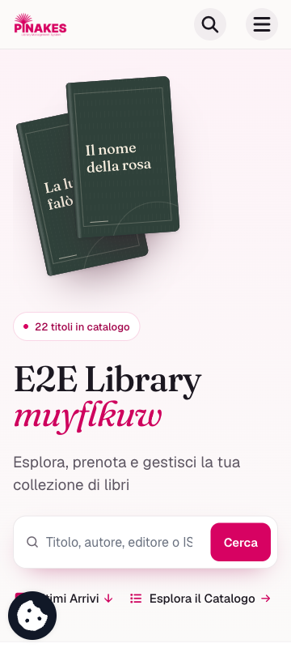 | 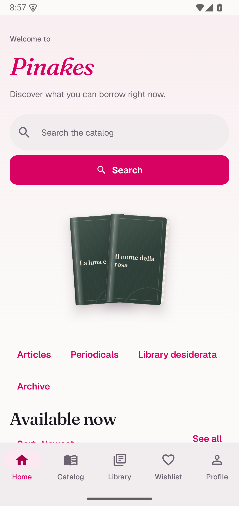 |
| Catalogo: libri, articoli, Desiderata e archivio | 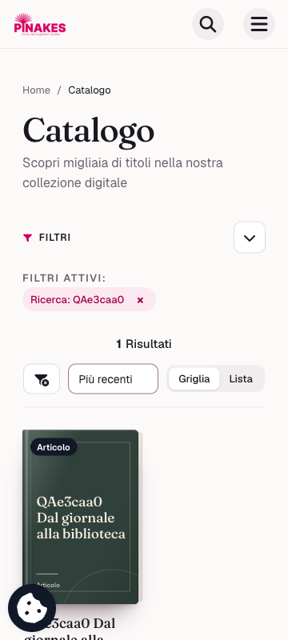 | 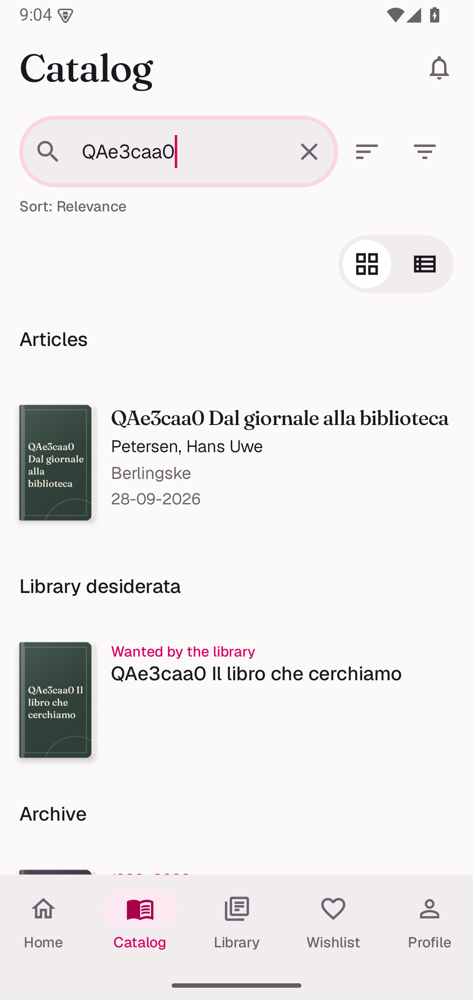 |
| Desiderata, distinta dalla wishlist personale | 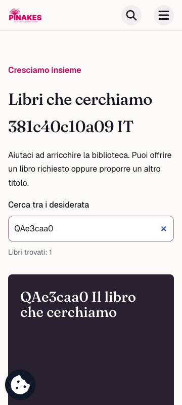 | 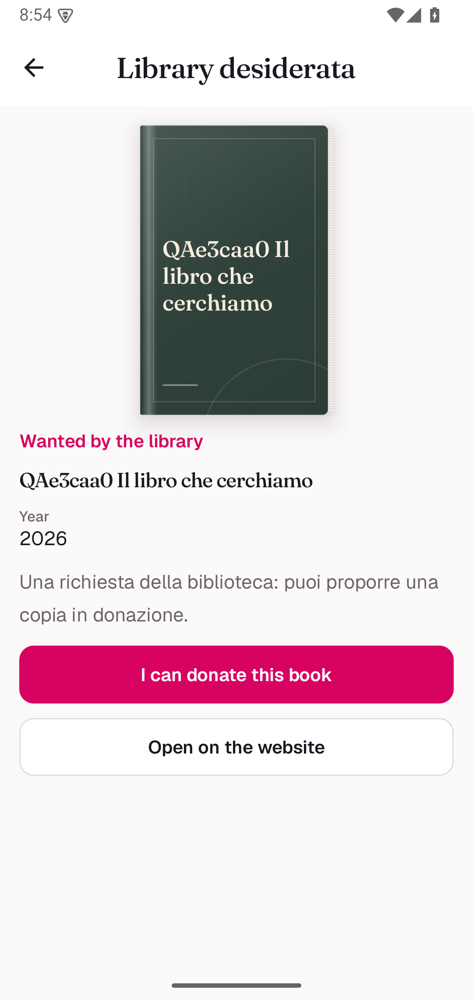 |
| Articolo autonomo e dati bibliografici | 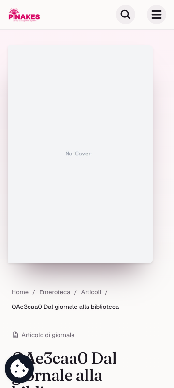 | 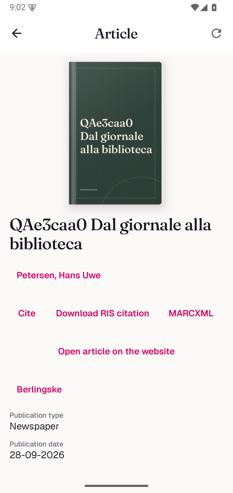 |
| Citazione Oxford con la data completa | 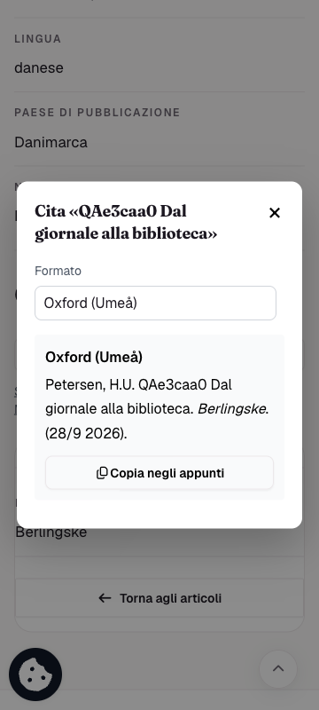 | 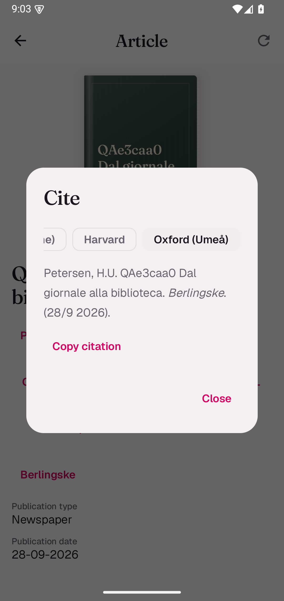 |
| Archivio: gerarchia, descrizione e consistenza | 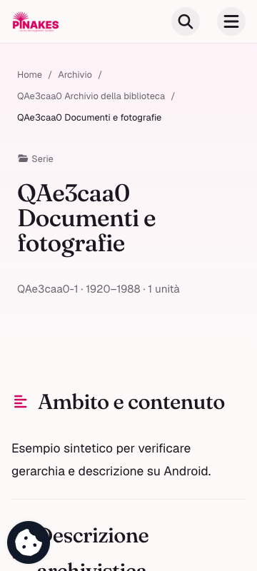 | 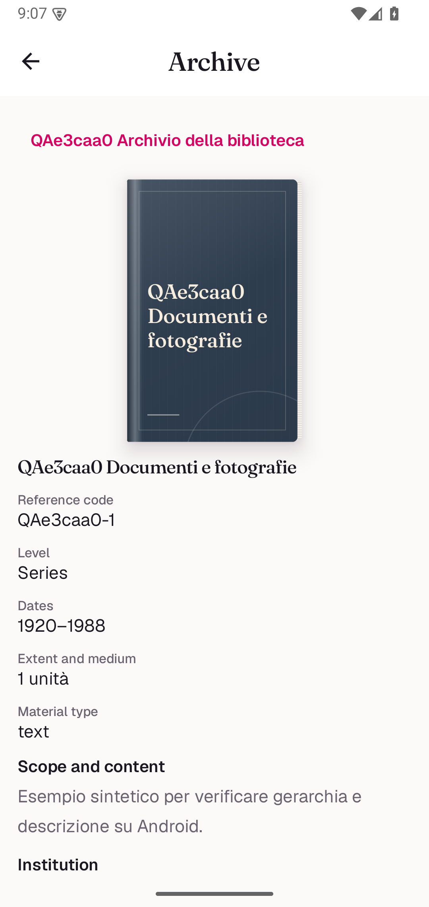 |

La proposta effettuata dal client nativo ha prodotto un'offerta nel database e zero copie inventariali. Offerta, account e record di prova sono stati eliminati; le impostazioni temporanee sono state ripristinate. La navigazione inferiore Home/Catalogo/Biblioteca/Wishlist/Profilo resta nell'app.

[verification.json](verification.json) registra i commit funzionali provati e i conteggi dei test. I successivi commit di documentazione e preparazione della release non sono presentati come nuove prove su dispositivo. Le CI delle PR devono completarsi sul loro ultimo commit prima del rilascio.

Per ottenere le nuove raccolte occorrono Mobile API 1.5.0, Desiderata 1.2.0, Emeroteca 1.13.0 e Archives 1.5.1. La gestione amministrativa apre il PHP protetto. L'import FBI/DBC (#52) resta esterno a questo rilascio; il caso ANR dell'emulatore GUI non viene dichiarato risolto sui dispositivi reali.
